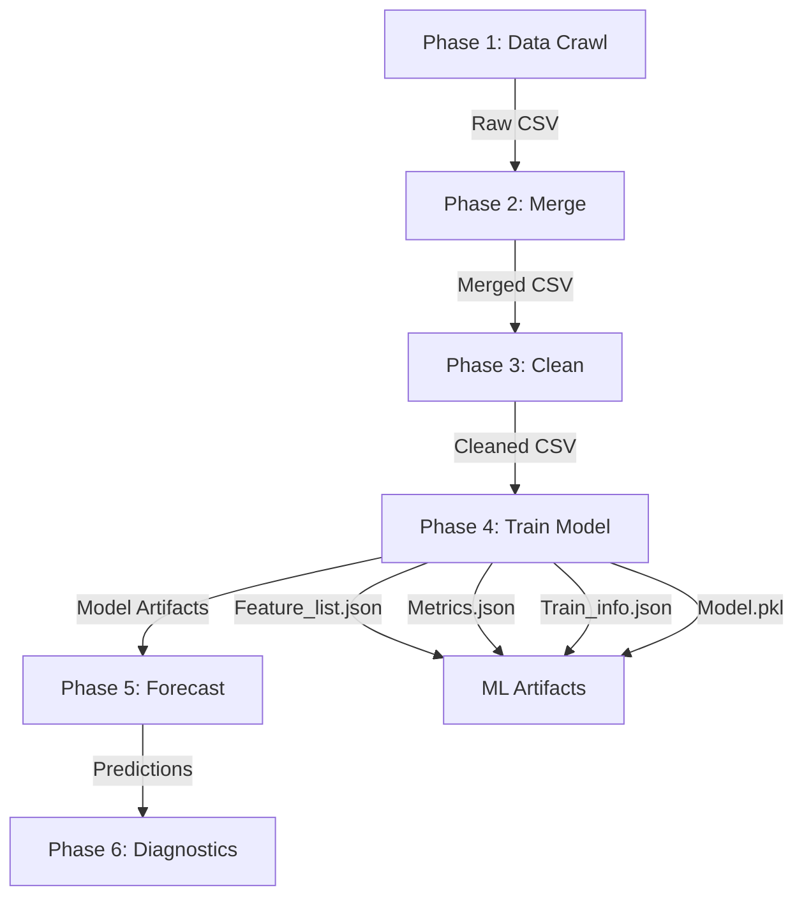
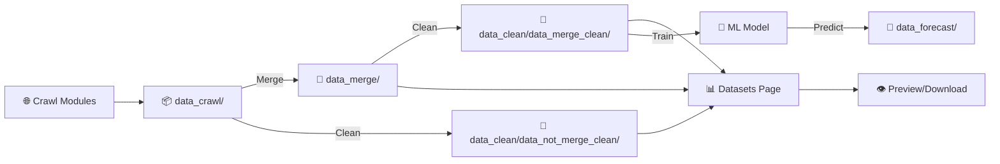

<div align="center">

# 🌦️ VN Weather Hub — End-to-End Weather Intelligence Platform

**Full-stack Django application** for **weather data collection** → **processing** → **machine learning** → **forecasting** with beautiful glassmorphism UI and multilingual support.

<br/>


<br/>
<sub>🌐 Multi-source crawling • 🔗 Smart merging • 🧹 Data cleaning • 🧠 ML training • 🔮 Forecasting • 📊 Dashboard • 🎨 Modern UI • 🌍 Bilingual</sub>

</div>

---

<div align="center">
  


*Enterprise-grade weather data pipeline with modern glassmorphism interface*

</div>

---

## 📌 Table of Contents

<details open>
<summary><b>📚 Navigation</b></summary>

- [🎯 Overview](#-overview)
- [✨ Key Features](#-key-features)
- [🧠 Machine Learning Pipeline](#-machine-learning-pipeline)
- [🌍 Internationalization (i18n)](#-internationalization-i18n)
- [🎨 UI/UX Features](#-uiux-features)
- [🔐 Authentication System](#-authentication-system)
- [📊 Data Pipeline](#-data-pipeline)
- [🗂️ Project Structure](#️-project-structure)
- [🚀 Installation & Setup](#-installation--setup)
- [📖 User Guide](#-user-guide)
- [🔧 Configuration](#-configuration)
- [🐛 Troubleshooting](#-troubleshooting)
- [🗺️ Roadmap](#️-roadmap)
- [👥 Team](#-team)

</details>

---

## 🎯 Overview

**VN Weather Hub** is a comprehensive **Django-based weather intelligence platform** that provides end-to-end data pipeline capabilities—from multi-source data collection to advanced machine learning forecasting. Built with modern web technologies, it features a stunning glassmorphism UI, bilingual support (Vietnamese/English), and enterprise-grade security.

### 🎯 Core Objectives

- 🌐 **Multi-Source Data Collection**: Crawl weather data from OpenWeather API, Vrain API, Selenium scraping, and HTML parsing
- 🔗 **Intelligent Data Integration**: Merge heterogeneous datasets with conflict resolution and schema validation
- 🧹 **Advanced Data Cleaning**: Automated cleaning wizard with customizable pipelines
- 🧠 **Machine Learning**: Train and deploy forecasting models (Ensemble, XGBoost, LightGBM, CatBoost, RandomForest)
- 🔮 **Weather Forecasting**: Generate multi-day weather predictions with confidence intervals
- 📊 **Interactive Dashboard**: Real-time metrics, visualization, and dataset management
- 🎨 **Modern UX**: Glassmorphism design with weather-themed animations
- 🌍 **Multilingual**: Full Vietnamese and English localization

---

## ✨ Key Features

### 📊 Data Management

| Feature | Description |
|---------|-------------|
| 🌐 **Multi-source crawling** | OpenWeather API, Vrain API/Selenium/HTML parser |
| 🔗 **Smart merging** | Automatic schema alignment, conflict resolution, duplicate removal |
| 🧹 **Cleaning wizard** | Step-by-step guided cleaning with preview and validation |
| 👁️ **Dataset preview** | In-browser CSV/Excel/JSON/TXT preview with pagination |
| ⬇️ **Export** | Download in multiple formats (CSV, XLSX, JSON, TXT) |
| 📈 **Statistics** | Real-time metrics, file counts, dataset sizes |

### 🧠 Machine Learning

| Feature | Description |
|---------|-------------|
| 🏗️ **Model training** | Support for 5 algorithms: Ensemble, XGBoost, LightGBM, CatBoost, RandomForest |
| 🔮 **Forecasting** | Multi-day weather prediction with rain detection |
| 📊 **Evaluation** | Comprehensive metrics: MAE, RMSE, MAPE, R², Rain Accuracy |
| 🎛️ **Hyperparameter tuning** | Grid search, random search, Optuna integration |
| 💾 **Model versioning** | Automatic artifact management and versioning |
| 📓 **Notebook pipeline** | Jupyter notebook for entire ML workflow (31 cells) |

### 🌍 Internationalization

| Feature | Description |
|---------|-------------|
| 🇻🇳 **Vietnamese** | Full Vietnamese localization (default) |
| 🇬🇧 **English** | Complete English translation |
| 🔄 **Live switching** | Toggle language without page reload |
| 🎨 **Context-aware** | Dynamic translations with template tags |
| 📝 **250+ strings** | Comprehensive coverage of all UI elements |

### 🔐 Security & Authentication

| Feature | Description |
|---------|-------------|
| 🔑 **Login** | Username or email login with JWT tokens |
| 📝 **Registration** | Email OTP verification before account creation |
| 🔄 **Password reset** | Secure OTP-based password recovery |
| 🛡️ **Account lockout** | Auto-lock after 5 failed attempts (5 min) |
| 📧 **Email validation** | MX record check, disposable email blocking |
| 🔐 **Password security** | Pepper + hash, strength validation |
| 👤 **Profile** | User profile management and settings |

### 🎨 UI/UX Excellence

| Feature | Description |
|---------|-------------|
| 🪟 **Glassmorphism** | Modern frosted glass design with blur effects |
| 🌧️ **Weather animations** | Rain, wind, lightning, mist, aurora effects |
| 🎭 **Responsive** | Mobile-first design, works on all devices |
| 🎨 **Theme effects** | Dynamic gradient backgrounds, neon accents |
| ⚡ **Performance** | Optimized animations with reduced-motion support |
| 🎯 **Accessibility** | ARIA labels, keyboard navigation, screen reader support |

---

## 🧠 Machine Learning Pipeline

### 📋 Complete ML Workflow (6 Phases)

The platform includes a comprehensive Jupyter notebook (`tremblingProcess.ipynb`) that orchestrates the entire ML pipeline:



### 🔄 Phase Details

#### Phase 1: Data Collection
- Run crawling scripts (API/Selenium/HTML)
- Output: Raw CSV files in `data/data_crawl/`
- Sources: OpenWeather, Vrain (multiple methods)

#### Phase 2: Data Merging
- Execute `scripts/merge_csv.py`
- Align schemas, resolve conflicts
- Output: Merged file in `data/data_merge/`

#### Phase 3: Data Cleaning (4 steps)
1. ~~Column renaming~~ → **SKIPPED** (handled by Cleardata)
2. Run `Cleardata.py` (main cleaning)
3. ~~Additional cleaning~~ → **SKIPPED** (duplicate)
4. Clean NaN datetime with `clean_datetime_nan.py`

#### Phase 4: Model Training
- Update `train_config.json` with latest dataset
- Run `manage.py train_model`
- Generates 4 artifacts:
  - `Feature_list.json` — Feature schema for predictions
  - `Metrics.json` — Model performance metrics
  - `Train_info.json` — Training configuration metadata
  - `Model.pkl` — Serialized trained model

#### Phase 5: Weather Forecasting
- Execute `WeatherForcast.py`
- Output: `data/data_forecast/forecast_results.csv` (13,431 rows)
- Includes rain detection and confidence scores

#### Phase 6: Diagnostics
- Run `scripts/run_diagnostics.py`
- Generate health check reports
- Validate data quality

### 🎯 Supported Machine Learning Models

| Model | Technology | Use Case | Performance |
|-------|-----------|----------|-------------|
| **RandomForest** | Scikit-learn | Baseline, feature importance | R² = 0.68 |
| **XGBoost** | XGBoost 3.2 | High performance, gradient boosting | R² = 0.72 |
| **LightGBM** | LightGBM 4.6 | Fast training, large datasets | R² = 0.71 |
| **CatBoost** | CatBoost 1.2 | Categorical feature handling | R² = 0.70 |
| **Ensemble** | Voting ensemble | Combines multiple models for stable forecasting | R² = 0.70, Acc = 93.7% |

### 📊 Model Evaluation Metrics

```json
{
  "model": "ensemble",
  "metrics": {
    "r2_score": 0.70,
    "mae": 2.84,
    "rmse": 3.61,
    "mape": 12.5,
    "rain_detection_accuracy": 0.937
  },
  "training_time": "2.3s",
  "dataset_size": 13431,
  "features_count": 42
}
```

### 🗂️ ML Artifacts Structure

```
Machine_learning_artifacts/
├── latest/                      # Current production model
│   ├── Feature_list.json        # Feature schema (42 features)
│   ├── Metrics.json             # Performance metrics
│   ├── Train_info.json          # Training metadata
│   └── Model.pkl                # Trained model (serialized)
└── old_model/                   # Previous version backup
    ├── Feature_list.json
    ├── Metrics.json
    └── Train_info.json
```

### 🔧 Training Configuration

**File:** `config/train_config.json`

```json
{
  "data": {
    "filename": "merged_vrain_data_cleaned_20260307_223506.clean_final.csv",
    "target_column": "rain_total",
    "date_column": "datetime"
  },
  "model": {
    "type": "ensemble",
    "params": {
      "n_estimators": 100,
      "max_depth": 10,
      "learning_rate": 0.1
    }
  },
  "split": {
    "train_ratio": 0.7,
    "valid_ratio": 0.15,
    "test_ratio": 0.15,
    "shuffle": false
  }
}
```

### 🚀 Training a Model

#### Via Django Management Command
```bash
python manage.py train_model
```

#### Via Direct Script
```bash
python Weather_Forcast_App/Machine_learning_model/trainning/train.py \
  --config Weather_Forcast_App/Machine_learning_model/config/train_config.json
```

#### Via Jupyter Notebook
```bash
jupyter notebook Weather_Forcast_App/Evaluate_accuracy/tremblingProcess.ipynb
```

### 🔮 Making Predictions

#### Via Web Interface
1. Navigate to **🔮 Weather Forecast** page
2. Select date range and location
3. View predictions with confidence intervals

#### Via Python Script
```python
from Weather_Forcast_App.Machine_learning_model.interface.predictor import WeatherPredictor

predictor = WeatherPredictor()
predictions = predictor.predict(date='2026-03-10', city='Ho Chi Minh City')
print(f"Predicted rain: {predictions['rain_total']} mm")
```

---

## 🌍 Internationalization (i18n)

### 🔄 Language Support

VN Weather Hub provides comprehensive bilingual support with seamless language switching.

#### Supported Languages
- 🇻🇳 **Tiếng Việt** (Vietnamese) — Default
- 🇬🇧 **English** — Full translation

#### Features
- ✅ **250+ translated strings** covering all UI elements
- ✅ **Live switching** without page reload
- ✅ **Context-aware** translations via custom template tags
- ✅ **URL persistence** — language preference saved in URL
- ✅ **Session storage** — remembers user language choice

### 📂 Translation Files

```
Weather_Forcast_App/i18n/
├── locales/
│   ├── vi.json                  # Vietnamese translations
│   └── en.json                  # English translations
├── context_processor.py         # Django context processor
├── middleware.py                # Language detection middleware
└── hooks.ts / index.ts          # Frontend i18n utilities
```

### 🔧 Usage in Templates

```html


<!-- Simple translation -->
<h1></h1>

<!-- With variables -->
<p></p>

<!-- Language switcher -->

  <a href="">Switch to English</a>

  <a href="">Chuyển sang Tiếng Việt</a>

```

### 📝 Translation Keys (Examples)

#### Homepage (`home.*`)
```json
{
  "home.hero_title": "Vietnam Weather Data in Real Time",
  "home.hero_desc": "Collect, process, and forecast weather data with machine learning",
  "home.btn_crawl": "Start Data Collection",
  "home.btn_datasets": "Browse Datasets",
  "home.btn_train": "Train Model",
  "home.btn_predict": "Weather Forecast"
}
```

#### Datasets Page (`datasets.*`)
```json
{
  "datasets.tab_recent": "Recent Raw Data",
  "datasets.tab_merged": "Merged Data",
  "datasets.tab_cleaned": "Cleaned Data",
  "datasets.tab_process": "Process Data",
  "datasets.stat_total_files": "Total Files",
  "datasets.stat_total_size": "Total Size"
}
```

#### Authentication (`auth.*`)
```json
{
  "auth.login_title": "Login to Your Account",
  "auth.register_title": "Create New Account",
  "auth.forgot_password": "Forgot Password?",
  "auth.email_verification": "Email Verification Required",
  "auth.otp_sent": "OTP code sent to your email"
}
```

### 🌐 Adding New Translations

1. **Add key to JSON files:**
```json
// locales/vi.json
{
  "feature.new_key": "Nội dung tiếng Việt"
}

// locales/en.json
{
  "feature.new_key": "English content"
}
```

2. **Use in template:**
```html

<p></p>
```

3. **Restart Django server** to reload translations

---

## 🎨 UI/UX Features

### 🪟 Glassmorphism Design System

The platform uses a modern glassmorphism design language inspired by Apple's design philosophy:

#### Visual Elements
- **Frosted glass cards** with backdrop-filter blur
- **Semi-transparent backgrounds** with gradient overlays
- **Neon accent colors** for CTAs and highlights
- **Soft shadows** with multiple layers
- **Smooth transitions** on all interactive elements

#### Color Palette
```css
/* Primary Colors */
--cyan: #22d3ee;           /* Accent cyan */
--blue: #3b82f6;           /* Primary blue */
--purple: #a78bfa;         /* Secondary purple */
--green: #22c55e;          /* Success green */

/* Background Gradients */
--bg0: #020617;            /* Deep dark blue-black */
--bg1: #0f172a;            /* Dark slate */
--card: rgba(15,23,42,0.7);/* Glass card background */

/* Text Colors */
--text: #e5e7eb;           /* Main text (light gray) */
--muted: #94a3b8;          /* Muted text (slate) */
```

### 🌧️ Weather-Themed Animations

#### Background Effects (CSS-based)
- **Rain effect** — Vertical rain streaks with shimmer animation
- **Wind blow** — Horizontal gradient sweep
- **Mist/Fog** — Floating radial gradients
- **Aurora shimmer** — Large-scale color rotation
- **Lightning flash** — Periodic brightness pulses
- **Wave ripple** — Horizontal sine-wave patterns

#### Interactive Animations
- **Button hover effects** — Scale + glow + lift transforms
- **Card entrance** — Fade-in with slide-up
- **Logo pulse** — Breathing animation with color cycle
- **Floating orbs** — Particle system drifting across viewport

#### Accessibility
```css
@media (prefers-reduced-motion: reduce) {
  * {
    animation-duration: 0.01ms !important;
    animation-iteration-count: 1 !important;
    transition-duration: 0.01ms !important;
  }
}
```

### 📱 Responsive Design

| Breakpoint | Device | Adjustments |
|-----------|--------|-------------|
| `>1200px` | Desktop | Full 3-column grid, side-by-side panels |
| `768px-1200px` | Tablet | 2-column grid, collapsible sidebar |
| `<768px` | Mobile | Single column, stacked layout, bottom nav |

### ✨ Enhanced Button System

#### Primary Button (Main Actions)
```css
.btn.primary {
  background: linear-gradient(135deg, #0ea5e9 0%, #22c55e 100%);
  border: 1.5px solid rgba(34,211,238,0.28);
  box-shadow: 
    0 16px 48px rgba(34,211,238,0.32),
    0 8px 24px rgba(52,211,153,0.22),
    0 0 20px rgba(34,211,238,0.12) inset;
}

.btn.primary:hover {
  transform: translateY(-3px) scale(1.02);
  box-shadow: 
    0 22px 56px rgba(34,211,238,0.4),
    0 14px 32px rgba(52,211,153,0.28),
    0 0 28px rgba(34,211,238,0.2);
}
```

#### Features
- **Gradient backgrounds** with smooth color transitions
- **Multi-layer shadows** for depth perception
- **Scale transforms** on hover (1.02x)
- **Lift effect** with translateY(-3px)
- **Pulse animation** on primary CTAs

---

## 🔐 Authentication System

### 📋 Features Overview

| Feature | Description |
|---------|-------------|
| 🔑 **Login** | Username or email login with JWT tokens |
| 📝 **Registration** | Two-step process with email OTP verification |
| 🔄 **Password Reset** | Three-step OTP-based recovery |
| 🛡️ **Account Lockout** | Auto-lock after 5 failed attempts (5 minutes) |
| 📧 **Email Security** | MX record validation, disposable email blocking |
| 🔐 **Password Strength** | Min 8 chars, uppercase, lowercase, number, special char |
| 👤 **Profile Management** | Update name, email, view activity |

### 🔑 Login Flow

```
User Input (username/email + password)
        ↓
Find account in MongoDB (username OR email)
        ↓
Check account locked? → Yes: Show lockout message
        ↓ No
Check account active? → No: Show activation message
        ↓ Yes
Verify password (hash + pepper)
        ↓
Create JWT token (role, manager_id)
        ↓
Save to session + Set cookie
        ↓
Redirect to Home page ✅
```

#### Security Features
- **Pepper-enhanced hashing:** `hash(password + PEPPER_SECRET)`
- **Failed attempt tracking:** Counter increments on wrong password
- **Auto-lockout:** 5 attempts → lock for 5 minutes
- **JWT tokens:** Stateless authentication with expiry
- **Session management:** Secure session storage

### 📝 Registration Flow (2 Steps)

#### Step 1: Register Form
```
Input: First/Last Name, Username, Email, Password
        ↓
Validation:
├── Email format + MX records check
├── Block disposable emails (tempmail, guerrilla, etc.)
├── Username unique check
├── Email not already registered
├── Password strength validation
        ↓
Generate 5-digit OTP
        ↓
Send OTP email (Gmail SMTP / Resend API)
        ↓
Save registration data to session (temporary)
        ↓
Redirect to OTP verification page
```

#### Step 2: OTP Verification
```
Input: 5-digit OTP code
        ↓
Verify OTP hash (SHA-256 + salt)
        ↓
Check expiry (10 minutes TTL)
        ↓
Check attempts (max 5)
        ↓
Create account in MongoDB
        ↓
Auto-login with JWT
        ↓
Redirect to Home ✅
```

#### Password Requirements
```
✅ Minimum 8 characters
✅ At least 1 lowercase letter (a-z)
✅ At least 1 uppercase letter (A-Z)
✅ At least 1 digit (0-9)
✅ At least 1 special character (!@#$%^&*()-_+=)
```

#### Email Validation
| Check | Description |
|-------|-------------|
| **Syntax** | RFC 5322 format validation |
| **Unicode** | Reject non-ASCII characters |
| **MX Records** | Verify domain can receive email |
| **Disposable** | Block tempmail, mailinator, guerrillamail, etc. |
| **Trusted Domains** | Skip MX check for gmail.com, yahoo.com, outlook.com |

### 🔄 Password Reset Flow (3 Steps)

#### Step 1: Request Reset
```
Input: Email address
        ↓
Check email exists in database
        ↓
Generate 5-digit OTP
        ↓
Send OTP email
        ↓
Redirect to OTP verification
```

#### Step 2: Verify OTP
```
Input: 5-digit OTP
        ↓
Verify OTP hash + expiry + attempts
        ↓
Mark OTP as verified
        ↓
Redirect to password reset form
```

#### Step 3: Set New Password
```
Input: New password + Confirm password
        ↓
Validate password strength
        ↓
Check passwords match
        ↓
Update password in database (hash + pepper)
        ↓
Invalidate all existing OTPs
        ↓
Redirect to Login ✅
```

### 📧 Email OTP System

#### OTP Security
| Feature | Implementation |
|---------|----------------|
| **Generation** | `secrets.randbelow(100000)` (cryptographically secure) |
| **Storage** | SHA-256 hash(otp + salt + secret_key), never plain text |
| **Expiry** | 10 minutes TTL (MongoDB TTL index auto-delete) |
| **Attempts** | Max 5 attempts, then request new OTP |
| **Invalidation** | Old OTPs invalidated when new one generated |

#### Email Providers (Priority Order)
1. **Gmail SMTP** (recommended) — Most reliable
2. **Resend API** — If RESEND_API_KEY configured
3. **Console Mode** — Development fallback (prints to terminal)

#### Gmail SMTP Configuration
```env
EMAIL_BACKEND=django.core.mail.backends.smtp.EmailBackend
EMAIL_HOST=smtp.gmail.com
EMAIL_PORT=587
EMAIL_HOST_USER=your_email@gmail.com
EMAIL_HOST_PASSWORD=your_16_char_app_password
EMAIL_USE_TLS=True
DEFAULT_FROM_EMAIL=VN Weather Hub <your_email@gmail.com>
```

**How to get Gmail App Password:**
1. Go to [Google Account](https://myaccount.google.com/)
2. Enable **2-Step Verification** (Security section)
3. Generate **App Password** for Mail app
4. Copy 16-character password to `EMAIL_HOST_PASSWORD`

### 👤 Profile Management

**Route:** `/profile/`

#### Features
- View account details (name, username, email, role)
- Update first/last name
- Update email (with uniqueness check)
- View registration date and last login
- See account role (Staff/Manager/Admin)

### 🗄️ MongoDB Collections

#### Collection: `logins`
```javascript
{
  "_id": ObjectId("..."),
  "name": "Võ Anh Nhật",
  "userName": "nhat123",
  "email": "nhat@gmail.com",
  "password": "pbkdf2_sha256$...",  // Hashed with pepper
  "role": "Staff",                   // Staff | Manager | Admin
  "is_active": true,
  "failed_attempts": 0,
  "lock_until": null,
  "last_login": ISODate("2026-03-08T10:30:00Z"),
  "createdAt": ISODate("2026-01-15T08:00:00Z"),
  "updatedAt": ISODate("2026-03-08T10:30:00Z")
}
```

#### Collection: `email_verification_otps`
```javascript
{
  "_id": ObjectId("..."),
  "email": "nhat@gmail.com",
  "otpHash": "sha256_hash_string",  // Never stores plain OTP
  "salt": "random_hex_salt",
  "attempts": 0,
  "used": false,
  "createdAt": ISODate("2026-03-08T10:00:00Z"),
  "expiresAt": ISODate("2026-03-08T10:10:00Z"),  // TTL: 10 min
  "verifiedAt": null                              // Set when verified
}
```

#### Collection: `password_reset_otps`
```javascript
{
  "_id": ObjectId("..."),
  "email": "nhat@gmail.com",
  "otpHash": "sha256_hash_string",
  "salt": "random_hex_salt",
  "attempts": 0,
  "used": false,
  "createdAt": ISODate("2026-03-08T10:00:00Z"),
  "expiresAt": ISODate("2026-03-08T10:10:00Z"),
  "verifiedAt": null
}
```

---

## 📊 Data Pipeline

### 🗂️ Directory Structure

```
data/
├── data_crawl/              # Raw data from crawlers (12 files)
│   ├── Bao_cao_20260307_160220.xlsx
│   ├── Bao_cao_20260307_160230.csv
│   └── ...
├── data_merge/              # Merged datasets (2 files + log)
│   ├── merged_vrain_data.xlsx
│   ├── merged_files_log.txt
│   └── ...
├── data_clean/              # Cleaned datasets
│   ├── data_merge_clean/   # Cleaned from merged data (21 files)
│   │   ├── cleaned_merge_merged_vrain_data_20260307.csv
│   │   └── ...
│   └── data_not_merge_clean/  # Cleaned from raw data
│       ├── cleaned_output_Bao_cao_20260307.csv
│       └── ...
└── data_forecast/           # Forecast results (NEW)
    └── forecast_results.csv  # 13,431 predictions
```

### 🔄 Data Flow



### 📥 Data Sources

| Source | Method | File Format | Frequency |
|--------|--------|-------------|-----------|
| **OpenWeather API** | REST API | JSON → CSV | Hourly |
| **Vrain API** | REST API | JSON → CSV | Daily |
| **Vrain Selenium** | Web scraping | HTML → CSV | On-demand |
| **Vrain HTML Parser** | Static parsing | HTML → CSV | On-demand |

### 🔗 Merge Process

#### Features
- **Schema alignment**: Automatically align column names and types
- **Conflict resolution**: Handle duplicate timestamps with configurable strategies
- **Deduplication**: Remove exact duplicate rows
- **Validation**: Check data integrity before/after merge
- **Logging**: Detailed merge log with file info and statistics

#### Merge Strategies
```python
# Configuration in merge script
MERGE_CONFIG = {
    "on": ["datetime", "city"],        # Join keys
    "how": "outer",                    # Join type
    "suffixes": ["_src1", "_src2"],   # Handle column conflicts
    "validate": "1:1"                  # Ensure no duplicates
}
```

### 🧹 Clean Process

#### Cleaning Pipeline (4 Steps)

**Step 1:** Column Renaming (Skipped - handled by Cleardata)

**Step 2:** Main Cleaning (`Cleardata.py`)
- Remove duplicate rows
- Handle missing values (fill/drop)
- Standardize datetime formats
- Remove outliers
- Normalize units (e.g., temperature °C/°F, pressure hPa/mmHg)
- Validate data ranges

**Step 3:** Additional Cleaning (Skipped - duplicate of Step 2)

**Step 4:** DateTime NaN Cleaning (`clean_datetime_nan.py`)
- Fix invalid datetime values
- Fill missing dates with interpolation
- Remove rows with critical datetime errors

#### Clean Wizard UI (3 Steps)

```
Step 1: Select Source
├── 🔗 Merged data (from data_merge/)
└── 📦 Raw data (from data_crawl/)
        ↓
Step 2: Choose File
├── Search/filter files
├── View file metadata (size, date)
└── Select file to clean
        ↓
Step 3: Track Progress
├── Real-time log output
├── Progress percentage
├── Error/warning messages
└── Download cleaned file ✅
```

### 👁️ Dataset Preview

#### CSV/Excel (Table Mode)
- **Pagination**: 50 rows per page
- **Sortable columns**: Click header to sort
- **Search**: Filter by any column value
- **Metadata**: Row count, column count, file size
- **Export**: Download as CSV/XLSX/JSON

#### JSON (Syntax Highlighted)
```json
{
  "datetime": "2026-03-08T10:00:00",
  "temperature": 28.5,
  "humidity": 75,
  "rain_total": 12.3,
  "city": "Ho Chi Minh City"
}
```

#### TXT (Preformatted)
```
=== Weather Data Log ===
Date: 2026-03-08
Temperature: 28.5°C
Humidity: 75%
Rain: 12.3mm
```

### ⬇️ Download Options

| Format | Use Case | Features |
|--------|----------|----------|
| **CSV** | Data analysis, Excel | UTF-8 BOM, comma-delimited |
| **XLSX** | Business reports | Formatted headers, auto-width |
| **JSON** | API integration | Pretty-printed, indented |
| **TXT** | Logs, debugging | Plain text, line-delimited |

---

## 🗂️ Project Structure

```
PROJECT_WEATHER_FORECAST/
├── 📁 Weather_Forcast_App/         # Main Django application
│   ├── 📁 Enums/                   # Enumerations and constants
│   ├── 📁 Machine_learning_artifacts/
│   │   ├── 📁 latest/              # Current model artifacts
│   │   │   ├── Feature_list.json   # Feature schema
│   │   │   ├── Metrics.json        # Performance metrics
│   │   │   ├── Train_info.json     # Training metadata
│   │   │   └── Model.pkl           # Trained model
│   │   └── 📁 old_model/           # Previous version backup
│   ├── 📁 Machine_learning_model/  # ML pipeline modules
│   │   ├── 📁 config/              # Training configurations
│   │   │   ├── train_config.json   # Main config
│   │   │   └── default.yaml        # Default parameters
│   │   ├── 📁 data/                # Data loading and validation
│   │   │   ├── Loader.py           # Load CSV/XLSX to DataFrame
│   │   │   ├── Schema.py           # Data schema validation
│   │   │   └── Split.py            # Train/valid/test split
│   │   ├── 📁 evaluation/          # Model evaluation
│   │   │   ├── metrics.py          # Metric calculations
│   │   │   └── report.py           # Report generation
│   │   ├── 📁 features/            # Feature engineering
│   │   │   ├── Build_transfer.py   # Feature construction
│   │   │   └── Transformers.py     # Data transformers
│   │   ├── 📁 interface/           # Prediction interface
│   │   │   └── predictor.py        # WeatherPredictor class
│   │   ├── 📁 Models/              # ML model implementations
│   │   │   ├── Base_model.py       # Abstract base class
│   │   │   ├── Random_Forest_Model.py
│   │   │   ├── XGBoost.py
│   │   │   ├── LightGBM_Model.py
│   │   │   ├── CatBoost.py
│   │   │   └── Ensemble_Model.py    # Voting ensemble model
│   │   ├── 📁 trainning/           # Training pipeline
│   │   │   ├── train.py            # Main training script
│   │   │   └── tuning.py           # Hyperparameter tuning
│   │   └── 📁 WeatherForcast/      # Forecasting module
│   │       └── WeatherForcast.py   # Forecast generator
│   ├── 📁 Evaluate_accuracy/       # Evaluation notebooks
│   │   ├── tremblingProcess.ipynb  # Full ML pipeline (31 cells)
│   │   ├── evaluate.ipynb          # Model evaluation
│   │   └── MODEL_EVALUATION_SUMMARY.md
│   ├── 📁 i18n/                    # Internationalization
│   │   ├── 📁 locales/
│   │   │   ├── vi.json             # Vietnamese translations
│   │   │   └── en.json             # English translations
│   │   ├── context_processor.py    # Django context processor
│   │   ├── middleware.py           # Language middleware
│   │   └── hooks.ts / index.ts     # Frontend i18n
│   ├── 📁 middleware/              # Django middleware
│   │   ├── Auth.py                 # Authentication middleware
│   │   ├── Authentication.py       # Session handling
│   │   └── Jwt_handler.py          # JWT token processing
│   ├── 📁 Models/                  # Django models
│   │   └── Login.py                # User model (MongoDB)
│   ├── 📁 Repositories/            # Data access layer
│   │   └── Login_repositories.py   # User CRUD operations
│   ├── 📁 Seriallizer/             # Data serializers
│   │   └── 📁 Login/
│   │       ├── Base_login.py
│   │       ├── Create_login.py
│   │       └── Update_login.py
│   ├── 📁 management/              # Django management commands
│   │   └── 📁 commands/
│   │       ├── train_model.py      # Train ML model command
│   │       └── insert_first_data.py
│   ├── 📁 scripts/                 # Utility scripts
│   │   ├── Crawl_data_by_API.py
│   │   ├── Crawl_data_from_Vrain_by_API.py
│   │   ├── Crawl_data_from_Vrain_by_Selenium.py
│   │   ├── Crawl_data_from_html_of_Vrain.py
│   │   ├── Merge_xlsx.py           # Data merging
│   │   ├── Cleardata.py            # Data cleaning
│   │   ├── clean_datetime_nan.py   # DateTime cleanup
│   │   ├── run_diagnostics.py      # Health check
│   │   ├── Email_validator.py      # Email validation
│   │   ├── Login_services.py       # Auth services
│   │   └── email_templates.py      # Email templates
│   ├── 📁 static/weather/          # Static assets
│   │   ├── 📁 css/                 # Stylesheets
│   │   │   ├── Home.css            # Homepage styles (4500+ lines)
│   │   │   ├── Datasets.css        # Dataset page styles
│   │   │   ├── Auth.css            # Authentication styles
│   │   │   └── ...
│   │   ├── 📁 js/                  # JavaScript modules
│   │   │   ├── Home.js             # Homepage interactions
│   │   │   ├── Datasets.js         # Dataset management
│   │   │   └── ...
│   │   ├── 📁 theme/               # Design system
│   │   │   ├── color.css           # Color variables
│   │   │   ├── effect.css          # Visual effects
│   │   │   ├── animation.css       # Keyframe animations
│   │   │   └── typography.css      # Font system
│   │   └── 📁 img/                 # Images and icons
│   ├── 📁 templates/weather/       # Django templates
│   │   ├── Home.html               # Homepage
│   │   ├── Datasets.html           # Dataset browser
│   │   ├── Dataset_preview.html    # File preview
│   │   ├── HTML_Train.html         # Model training page
│   │   ├── HTML_Predict.html       # Weather forecast page
│   │   ├── 📁 auth/                # Authentication templates
│   │   │   ├── Login.html
│   │   │   ├── Register.html
│   │   │   ├── Verify_email_register.html
│   │   │   ├── Forgot_password.html
│   │   │   ├── Verify_otp.html
│   │   │   ├── Reset_password_otp.html
│   │   │   └── Profile.html
│   │   └── Sidebar_nav.html        # Navigation sidebar
│   ├── 📁 views/                   # Django views
│   │   ├── Home.py                 # Homepage view
│   │   ├── View_Datasets.py        # Dataset browser views
│   │   ├── View_Merge_Data.py      # Merge API endpoint
│   │   ├── View_Clear.py           # Clean wizard endpoints
│   │   ├── View_Crawl_*.py         # Crawl endpoints
│   │   ├── View_login.py           # Auth views
│   │   ├── View_Train.py           # Training views
│   │   └── View_Predict.py         # Forecast views
│   ├── urls.py                     # URL routing (44 patterns)
│   ├── db_connection.py            # MongoDB connection
│   └── paths.py                    # Path constants
├── 📁 WeatherForcast/              # Django project settings
│   ├── settings.py                 # Configuration
│   ├── urls.py                     # Root URL conf
│   ├── wsgi.py                     # WSGI entry point
│   └── asgi.py                     # ASGI entry point
├── 📁 data/                        # Data storage (see Data Pipeline section)
├── 📁 config/                      # Project configurations
│   └── train_config.json           # ML training config
├── manage.py                       # Django management script
├── requirements.txt                # Python dependencies
├── .env                            # Environment variables (gitignored)
├── README.md                       # This file
├── CHANGELOG.md                    # Version history and updates
└── debug_top50_errors.csv          # Error diagnostics
```

### 📦 Key Directories Explained

#### `Machine_learning_artifacts/`
Stores trained model artifacts separated by version:
- `latest/` — Current production model
- `old_model/` — Previous version backup

**Never commit** `.pkl` files to git (large binary files). Use `.gitignore`.

#### `Machine_learning_model/`
Complete ML pipeline with modular architecture:
- **data/**: Loading, validation, splitting
- **features/**: Engineering, transformation
- **Models/**: Algorithm implementations
- **trainning/**: Training orchestration
- **interface/**: Prediction API
- **evaluation/**: Metrics and reporting

#### `i18n/`
Internationalization system:
- **locales/**: JSON translation files (vi.json, en.json)
- **middleware.py**: Auto-detect language from URL/session
- **context_processor.py**: Inject `` template tag

#### `static/weather/`
Frontend assets with design system:
- **css/**: Organized by page + theme system
- **js/**: Vanilla JavaScript modules (no framework)
- **theme/**: Centralized design tokens (colors, shadows, spacing)

#### `templates/weather/`
Django templates with template tags:
- Server-side rendering for SEO
- `` for translations
- `` for asset URLs

---

## 🚀 Installation & Setup

### 📋 Requirements

| Requirement | Version | Purpose |
|------------|---------|---------|
| **Python** | 3.11+ | Core runtime |
| **Django** | 5.1+ | Web framework |
| **MongoDB** | 7.0+ | User database |
| **pip** | 24+ | Package manager |
| **virtualenv** | 20+ | Environment isolation |

### 🔧 Step-by-Step Installation

#### 1️⃣ Clone Repository
```bash
git clone https://github.com/TiCoder-coder/PROJECT_WEATHER_FORCAST.git
cd PROJECT_WEATHER_FORCAST
```

#### 2️⃣ Create Virtual Environment
```bash
# Create venv
python3 -m venv .venv

# Activate venv
source .venv/bin/activate  # Linux/macOS
.venv\Scripts\activate     # Windows
```

#### 3️⃣ Install Dependencies
```bash
# Install Python packages
pip install -r requirements.txt

# Verify installation
pip list
```

**Key packages:**
```txt
Django==5.1.5
djongo==1.3.6
pymongo==4.10.1  
pandas==2.2.0
numpy==1.26.0
scikit-learn==1.8.0
xgboost==3.2.0
lightgbm==4.6.0
catboost==1.2.10
seaborn==0.13.2
shap==0.51.0
selenium==4.27.1
beautifulsoup4==4.12.3
requests==2.32.3
openpyxl==3.1.5
python-dotenv==1.0.1
Pillow==11.0.0
```

#### 4️⃣ Configure Environment Variables

Create `.env` file in project root:

```env
# Django Settings
SECRET_KEY=django-insecure-4$t0@wnk+#qu19m66%a90(d10z69tr$-ei@u_pf_%#m5it@=t+
DEBUG=True
ALLOWED_HOSTS=localhost,127.0.0.1

# MongoDB Connection
MONGO_URI=mongodb://localhost:27017/Login?directConnection=true
DB_HOST=mongodb+srv://username:<password>@cluster0.mongodb.net/
DB_NAME=Login
DB_USER=username
DB_PASSWORD=your_password
DB_PORT=27017
DB_AUTH_SOURCE=admin
DB_AUTH_MECHANISM=SCRAM-SHA-256

# Authentication
PASSWORD_PEPPER=yPTp0tlNjhhCmktx_FInwo0bLcu2aquaT3BLVMJaQqw
JWT_SECRET=MHGtW9YsZcP1O04ScNbiOTVMPS-DCS_NKeenFBzaWXzR2Fk7_3xxnT2vubAMIuXNVybtBsCYifEYHxVW6fRnEQ
JWT_ALGORITHM=HS256
JWT_ACCESS_TTL=900
JWT_REFRESH_TTL=604800
MAX_FAILED_ATTEMPS=5
LOCKOUT_SECOND=300

# Email Configuration (Gmail SMTP)
EMAIL_BACKEND=django.core.mail.backends.smtp.EmailBackend
EMAIL_HOST=smtp.gmail.com
EMAIL_PORT=587
EMAIL_HOST_USER=your_email@gmail.com
EMAIL_HOST_PASSWORD=your_16_char_app_password
EMAIL_USE_TLS=True
DEFAULT_FROM_EMAIL=VN Weather Hub <your_email@gmail.com>

# OTP Settings
PASSWORD_RESET_OTP_EXPIRE_SECONDS=600
PASSWORD_RESET_OTP_MAX_ATTEMPTS=5

# Resend API (alternative to Gmail)
RESEND_API_KEY=re_your_resend_api_key
RESEND_FROM_EMAIL=onboarding@resend.dev

# Admin Account (first-time setup)
USER_NAME_ADMIN=admin
ADMIN_PASSWORD=Admin@2026
ADMIN_EMAIL=admin@vnweatherhub.com
```

#### 5️⃣ Set Up MongoDB

**Option A: MongoDB Atlas (Cloud)**
1. Create free cluster at [mongodb.com/cloud/atlas](https://www.mongodb.com/cloud/atlas)
2. Get connection string
3. Update `DB_HOST` in `.env`

**Option B: Local MongoDB**
```bash
# Install MongoDB
# Ubuntu
sudo apt install mongodb

# macOS
brew install mongodb-community

# Start MongoDB
sudo systemctl start mongodb  # Linux
brew services start mongodb-community  # macOS

# Verify running
mongosh --eval "db.version()"
```

#### 6️⃣ Initialize Database
```bash
# Run Django migrations (creates SQLite tables)
python manage.py migrate

# Create first admin user (inserts to MongoDB)
python manage.py insert_first_data

# Verify MongoDB collections
mongosh
> use Login
> db.logins.find()
```

#### 7️⃣ Run Development Server
```bash
python manage.py runserver

# Server starts at http://127.0.0.1:8000
```

#### 8️⃣ Access Application
Open browser and navigate to:
- **Homepage**: http://127.0.0.1:8000/
- **Login**: http://127.0.0.1:8000/login/
- **Register**: http://127.0.0.1:8000/register/
- **Datasets**: http://127.0.0.1:8000/datasets/
- **Admin**: http://127.0.0.1:8000/admin/ (use admin credentials)

---

### 🎯 Quick Start Commands

```bash
# Development workflow
python manage.py runserver           # Start dev server
python manage.py check               # Check Django configuration
python manage.py showurls            # List all URL patterns (if installed)

# ML commands
python manage.py train_model         # Train ML model
python Weather_Forcast_App/Machine_learning_model/trainning/train.py \
  --config Weather_Forcast_App/Machine_learning_model/config/train_config.json

# Database commands
python manage.py makemigrations      # Create migration files
python manage.py migrate             # Apply migrations
python manage.py insert_first_data   # Insert admin user

# Utility commands
python manage.py collectstatic       # Collect static files for production
python manage.py createsuperuser     # Create Django admin superuser
```

---

## 📖 User Guide

### 🏠 Homepage

#### Features
- **Hero section** with animated weather graphics
- **Quick actions** for data collection, training, forecasting
- **Activity cards** showing recent datasets and model status
- **Language switcher** (Vietnamese ⇄ English)
- **User profile** dropdown with logout option

#### Quick Actions
| Button | Action | Description |
|--------|--------|-------------|
| 🌐 **Start Data Collection** | Opens crawl modal | Choose data source (API/Selenium/HTML) |
| 📊 **Browse Datasets** | Navigate to datasets page | View all raw/merged/cleaned data |
| 🧠 **Train Model** | Open training page | Configure and train ML model |
| 🔮 **Weather Forecast** | Open forecast page | Generate predictions with trained model |
| ❓ **User Guide** | Opens help modal | Step-by-step tutorials |

### 📊 Datasets Page

#### Tabs
1. **📦 Recent Raw Data** (`data_crawl/`)
   - Latest crawled files
   - View, download, merge options
   
2. **🔗 Merged Data** (`data_merge/`)
   - Combined datasets
   - View, download, clean options
   
3. **🧹 Cleaned Data**
   - **From merged** (`data_merge_clean/`)
   - **From raw** (`data_not_merge_clean/`)
   
4. **🧪 Process Data**
   - Merge wizard
   - Clean wizard
   - Progress tracking

#### Actions
- **👁️ VIEW**: Preview file in browser (table/JSON/text)
- **⬇️ DOWNLOAD**: Download file to local machine
- **🔗 MERGE**: Combine multiple raw files
- **🧹 CLEAN**: Run cleaning pipeline on file

### 🧠 Train Model Page

#### Configuration
```json
{
  "dataset": "Select cleaned dataset",
  "target": "rain_total",
  "model_type": "ensemble | xgboost | lightgbm | catboost | randomforest",
  "train_ratio": 0.7,
  "valid_ratio": 0.15,
  "test_ratio": 0.15
}
```

#### Training Process
1. Select dataset from dropdown
2. Choose model algorithm
3. Configure train/valid/test split
4. Set hyperparameters (optional)
5. Click **🧠 Start Training**
6. Monitor progress bar
7. View metrics report
8. Download model artifacts

#### Output
- `Feature_list.json` — Feature schema
- `Metrics.json` — Performance metrics
- `Train_info.json` — Training metadata
- `Model.pkl` — Trained model binary

### 🔮 Weather Forecast Page

#### Input
- **Date range**: Start and end dates
- **Location**: City/province selection
- **Model**: Choose trained model

#### Output
```
Date       | Temperature | Humidity | Rain (mm) | Confidence
-----------|-------------|----------|-----------|------------
2026-03-09 | 28.5°C      | 75%      | 12.3      | 0.92
2026-03-10 | 27.8°C      | 78%      | 18.5      | 0.89
2026-03-11 | 29.2°C      | 72%      | 0.0       | 0.95
```

#### Visualization
- Line chart: Temperature over time
- Bar chart: Rain predictions
- Confidence intervals shaded areas
- Export to CSV/Excel

---

## 🔧 Configuration

### ⚙️ Django Settings

**File:** `WeatherForcast/settings.py`

#### Key Configurations

```python
# Application definition
INSTALLED_APPS = [
    'django.contrib.admin',
    'django.contrib.auth',
    'django.contrib.contenttypes',
    'django.contrib.sessions',
    'django.contrib.messages',
    'django.contrib.staticfiles',
    'Weather_Forcast_App',  # Main app
]

# Middleware
MIDDLEWARE = [
    'django.middleware.security.SecurityMiddleware',
    'django.contrib.sessions.middleware.SessionMiddleware',
    'django.middleware.common.CommonMiddleware',
    'django.middleware.csrf.CsrfViewMiddleware',
    'django.contrib.auth.middleware.AuthenticationMiddleware',
    'django.contrib.messages.middleware.MessageMiddleware',
    'django.middleware.clickjacking.XFrameOptionsMiddleware',
    'Weather_Forcast_App.i18n.middleware.LanguageMiddleware',  # i18n
    'Weather_Forcast_App.middleware.Authentication.JWTAuthenticationMiddleware',  # JWT
]

# Database (MongoDB via djongo)
DATABASES = {
    'default': {
        'ENGINE': 'djongo',
        'NAME': os.getenv('DB_NAME', 'Login'),
        'ENFORCE_SCHEMA': False,
        'CLIENT': {
            'host': os.getenv('DB_HOST'),
            'username': os.getenv('DB_USER'),
            'password': os.getenv('DB_PASSWORD'),
            'authSource': os.getenv('DB_AUTH_SOURCE', 'admin'),
            'authMechanism': os.getenv('DB_AUTH_MECHANISM', 'SCRAM-SHA-256'),
        }
    }
}

# Static files (CSS, JavaScript, Images)
STATIC_URL = '/static/'
STATICFILES_DIRS = [
    BASE_DIR / 'Weather_Forcast_App' / 'static',
]
STATIC_ROOT = BASE_DIR / 'staticfiles'

# Email configuration
EMAIL_BACKEND = os.getenv('EMAIL_BACKEND')
EMAIL_HOST = os.getenv('EMAIL_HOST')
EMAIL_PORT = int(os.getenv('EMAIL_PORT', 587))
EMAIL_HOST_USER = os.getenv('EMAIL_HOST_USER')
EMAIL_HOST_PASSWORD = os.getenv('EMAIL_HOST_PASSWORD')
EMAIL_USE_TLS = os.getenv('EMAIL_USE_TLS', 'True') == 'True'
DEFAULT_FROM_EMAIL = os.getenv('DEFAULT_FROM_EMAIL')

# Security
SESSION_COOKIE_HTTPONLY = True
SESSION_COOKIE_SECURE = False  # Set True in production with HTTPS
CSRF_COOKIE_HTTPONLY = True
CSRF_COOKIE_SECURE = False  # Set True in production
```

### 🔐 Security Settings

#### Production Checklist
```python
# settings.py (production overrides)
DEBUG = False
ALLOWED_HOSTS = ['yourdomain.com', 'www.yourdomain.com']
SECURE_SSL_REDIRECT = True
SESSION_COOKIE_SECURE = True
CSRF_COOKIE_SECURE = True
SECURE_HSTS_SECONDS = 31536000
SECURE_HSTS_INCLUDE_SUBDOMAINS = True
SECURE_HSTS_PRELOAD = True
SECURE_BROWSER_XSS_FILTER = True
SECURE_CONTENT_TYPE_NOSNIFF = True
X_FRAME_OPTIONS = 'DENY'
```

### 📊 ML Training Configuration

**File:** `config/train_config.json`

```json
{
  "data": {
    "filename": "merged_vrain_data_cleaned_20260307_223506.clean_final.csv",
    "target_column": "rain_total",
    "date_column": "datetime",
    "features": ["temperature", "humidity", "pressure", "wind_speed", "..."]
  },
  "model": {
    "type": "ensemble",
    "params": {
      "n_estimators": 100,
      "max_depth": 10,
      "learning_rate": 0.1
    }
  },
  "split": {
    "train_ratio": 0.7,
    "valid_ratio": 0.15,
    "test_ratio": 0.15,
    "shuffle": false,
    "random_state": 42
  },
  "feature_engineering": {
    "lag_features": [1, 2, 3, 6, 12, 24],
    "rolling_windows": [3, 6, 12, 24],
    "time_features": ["hour", "day", "month", "season"],
    "location_features": ["lat", "lon", "elevation"]
  },
  "evaluation": {
    "metrics": ["mae", "rmse", "mape", "r2", "rain_accuracy"],
    "save_predictions": true,
    "save_feature_importance": true
  }
}
```

---

## 🐛 Troubleshooting

### ❌ Common Errors

#### 1. `UnicodeEncodeError` on Windows
**Error:**
```
UnicodeEncodeError: 'charmap' codec can't encode character '\u2500'
```

**Solution:**
Set console encoding to UTF-8:
```python
# Add to top of script
import sys
import io
sys.stdout = io.TextIOWrapper(sys.stdout.buffer, encoding='utf-8')
```

Or use ASCII characters instead of Unicode:
```python
# Before
print("──────")  # Box-drawing characters
# After
print("------")  # ASCII hyphens
```

#### 2. MongoDB Connection Failed
**Error:**
```
pymongo.errors.ServerSelectionTimeoutError: localhost:27017: [Errno 111] Connection refused
```

**Solutions:**
```bash
# Check if MongoDB is running
sudo systemctl status mongodb  # Linux
brew services list             # macOS

# Start MongoDB
sudo systemctl start mongodb   # Linux
brew services start mongodb-community  # macOS

# Verify connection string in .env
MONGO_URI=mongodb://localhost:27017/Login?directConnection=true
```

#### 3. Email OTP Not Sending
**Error:**
```
SMTPAuthenticationError: (535, b'5.7.8 Username and Password not accepted')
```

**Solutions:**
1. **Check Gmail App Password:**
   - Go to Google Account → Security → 2-Step Verification → App passwords
   - Generate new app password
   - Update `EMAIL_HOST_PASSWORD` in `.env`

2. **Verify settings:**
   ```env
   EMAIL_HOST=smtp.gmail.com
   EMAIL_PORT=587
   EMAIL_USE_TLS=True
   EMAIL_HOST_USER=your_email@gmail.com
   EMAIL_HOST_PASSWORD=16_char_app_password
   ```

3. **Use console backend for testing:**
   ```env
   EMAIL_BACKEND=django.core.mail.backends.console.EmailBackend
   ```

#### 4. 404 on Static Files
**Error:**
```
Not Found: /static/weather/css/Home.css
```

**Solutions:**
```bash
# Collect static files
python manage.py collectstatic

# Verify STATIC_URL in settings.py
STATIC_URL = '/static/'

# Check file exists
ls Weather_Forcast_App/static/weather/css/Home.css
```

#### 5. Import Error: `ModuleNotFoundError`
**Error:**
```
ModuleNotFoundError: No module named 'xgboost'
```

**Solution:**
```bash
# Activate virtual environment
source .venv/bin/activate

# Install missing package
pip install xgboost

# Or reinstall all requirements
pip install -r requirements.txt
```

#### 6. Model Training Fails
**Error:**
```
KeyError: 'rain_total'
```

**Solutions:**
1. **Check dataset has target column:**
   ```python
   import pandas as pd
   df = pd.read_csv('data.csv')
   print(df.columns)
   ```

2. **Update `train_config.json`:**
   ```json
   {
     "data": {
       "target_column": "rain_total"  // Must match column name exactly
     }
   }
   ```

3. **Verify cleaned data:**
   - Open cleaned CSV file
   - Confirm column exists and has data

#### 7. JWT Token Expires Too Quickly
**Problem:**
User gets logged out after a few minutes.

**Solution:**
Increase token TTL in `.env`:
```env
# Default: 900 seconds (15 minutes)
JWT_ACCESS_TTL=3600  # 1 hour

# Refresh token
JWT_REFRESH_TTL=604800  # 7 days
```

#### 8. Language Not Switching
**Problem:**
Clicking language button doesn't change UI text.

**Solutions:**
1. **Check translations exist:**
   ```bash
   cat Weather_Forcast_App/i18n/locales/en.json
   cat Weather_Forcast_App/i18n/locales/vi.json
   ```

2. **Verify template tag:**
   ```html
   
   
   ```

3. **Clear browser cache:**
   ```
   Ctrl+Shift+Delete (Chrome/Firefox)
   ```

4. **Restart Django server:**
   ```bash
   python manage.py runserver
   ```

---

## 🗺️ Roadmap

### 🔜 Short-term (Q1-Q2 2026)

- [ ] 📈 **Enhanced Dashboard**
  - Interactive charts with Chart.js/D3.js
  - Real-time metrics updates via WebSocket
  - Export dashboard as PDF report

- [ ] 🔐 **Advanced Authentication**
  - OAuth2 integration (Google, Facebook, GitHub)
  - Two-factor authentication (2FA)
  - Role-based access control (RBAC)
  - Activity logging and audit trail

- [ ] ✅ **Robust Data Validation**
  - JSON Schema validation for all datasets
  - Auto-fix common data issues
  - Data quality score dashboard
  - Anomaly detection in raw data

- [ ] 🧠 **ML Model Improvements**
  - AutoML with Optuna hyperparameter tuning
  - Model explainability with SHAP values
  - A/B testing framework for models
  - Online learning capabilities

### 🚀 Medium-term (Q3-Q4 2026)

- [ ] 🌐 **RESTful API**
  - Complete REST API for all features
  - API authentication with API keys
  - Rate limiting and quota management
  - Interactive Swagger/OpenAPI documentation

- [ ] 🐳 **Containerization & Deployment**
  - Docker Compose setup for development
  - Kubernetes manifests for production
  - CI/CD pipeline with GitHub Actions
  - Automated testing suite

- [ ] 💾 **Data Storage Enhancements**
  - S3/MinIO for large file storage
  - Redis caching for frequently accessed data
  - PostgreSQL for relational data
  - Automated backup and restore

- [ ] 📱 **Mobile App**
  - React Native mobile application
  - Push notifications for forecast alerts
  - Offline mode with data sync
  - Mobile-optimized UI

### 🌟 Long-term (2027+)

- [ ] 🧪 **Advanced ML Pipelines**
  - Deep learning models (LSTM, Transformer)
  - Ensemble stacking with meta-learner
  - Transfer learning from global weather models
  - Multi-task learning (temperature + rain + wind)

- [ ] 🌍 **Geographic Expansion**
  - Support for multiple countries/regions
  - Multi-language support (10+ languages)
  - Timezone handling for global users
  - Regional weather pattern analysis

- [ ] 🔬 **Research Features**
  - Climate change trend analysis
  - Extreme weather event prediction
  - Integration with satellite data
  - Collaboration with meteorological agencies

- [ ] 🎨 **UI/UX Enhancements**
  - Dark mode with system preference detection
  - Customizable dashboard layouts
  - Accessibility compliance (WCAG 2.1 AA)
  - Interactive data visualization playground

---

## 👥 Team

### 🧑‍💻 Maintainers & Contributors

<table>
  <tr>
    <td align="center">
      <b>Võ Anh Nhật</b><br>
      <i>Team Lead & ML Engineer</i><br>
      📧 voanhnhat1612@gmail.com<br>
      📞 +84 335 052 899
    </td>
    <td align="center">
      <b>Võ Huỳnh Anh Tuần</b><br>
      <i>Full-stack Developer</i><br>
      📧 vohuynhanhtuan0512@gmail.com
    </td>
  </tr>
  <tr>
    <td align="center">
      <b>Trương Hoài Tú</b><br>
      <i>Frontend Developer</i><br>
      📧 hoaitu163@gmail.com
    </td>
    <td align="center">
      <b>Dư Quốc Việt</b><br>
      <i>Data Engineer</i><br>
      📧 duviet720@gmail.com
    </td>
  </tr>
</table>

### 🎓 Institution
**University of Technology and Humanities (UTH)**  
*Computer Science Department*

### 📅 Project Timeline
- **Started:** January 2026
- **Last Updated:** March 8, 2026
- **Status:** Active Development

---

## 📜 License & Acknowledgments

### 📄 License
This project is licensed under the **MIT License** — see the [LICENSE](LICENSE) file for details.

### 🙏 Acknowledgments

#### Data Sources
- **OpenWeather** — [openweathermap.org](https://openweathermap.org) — Free weather API
- **Vrain** — Vietnamese weather data provider

#### Technologies & Frameworks
- **Django** — Web framework by Django Software Foundation
- **MongoDB** — NoSQL database by MongoDB Inc.
- **Scikit-learn** — Machine learning library
- **XGBoost** — Gradient boosting framework by DMLC
- **LightGBM** — Fast gradient boosting by Microsoft
- **CatBoost** — Gradient boosting by Yandex
- **Pandas** — Data manipulation library
- **NumPy** — Numerical computing library

#### Design Inspiration
- **Glassmorphism** — Design trend by Michal Malewicz
- **Meteorological UI** — Inspired by Weather.com and Apple Weather

---

<div align="center">

### 🌦️ VN Weather Hub

**Making Weather Data Accessible Through Technology**

---

<sub>
Made with ☕ + ⛈️ by VN Weather Hub Team  
© 2026 University of Technology and Humanities
</sub>

<br/>

[](https://www.python.org/)
[](https://www.djangoproject.com/)
[](https://www.mongodb.com/)
[](LICENSE)
[](CONTRIBUTING.md)

</div>
