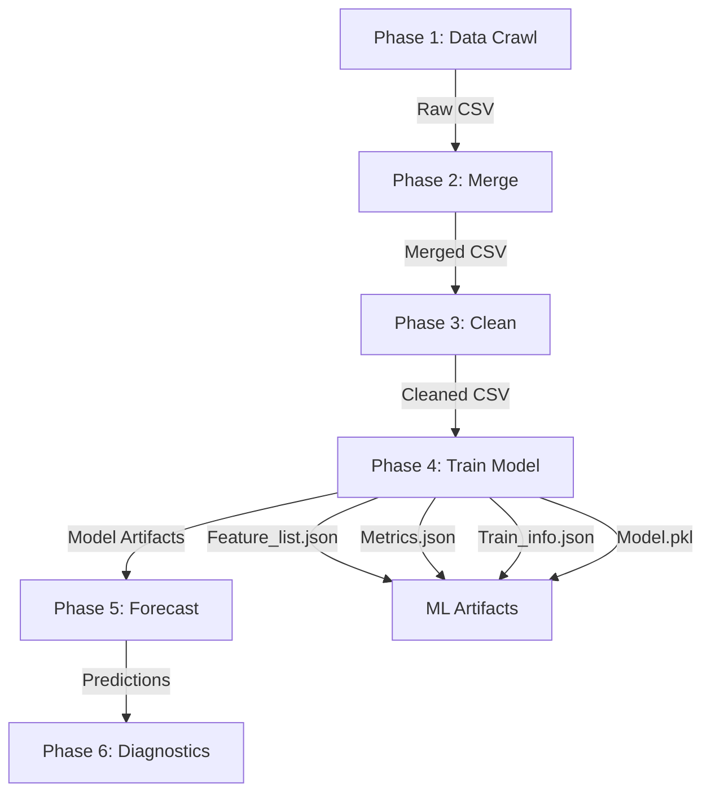
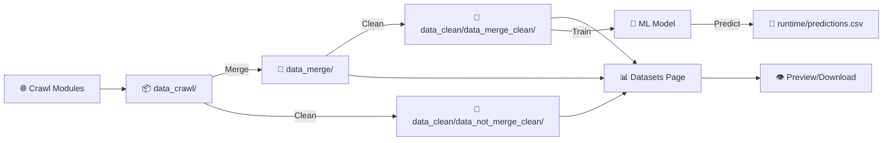

<div align="center">

# 🌦️ VN WEATHER HUB: NỀN TẢNG WEB THU THẬP - CHUẨN HOÁ - HỢP NHẤT DỮ LIỆU THỜI TIẾT ĐA NGUỒN VÀ DỰ BÁO NGẮN HẠN CHO VIỆT NAM BẰNG MÔ HÌNH STACKING ENSEMBLE

**Ứng dụng web Django đầy đủ tính năng** cho **thu thập dữ liệu thời tiết** → **xử lý** → **học máy** → **dự báo** với giao diện glassmorphism hiện đại và hỗ trợ đa ngôn ngữ.

<br/>


<br/>
<sub>🌐 Thu thập đa nguồn • 🔗 Gộp thông minh • 🧹 Làm sạch dữ liệu • 🧠 Huấn luyện ML • 🔮 Dự báo • 📊 Dashboard • 🎨 Giao diện hiện đại • 🌍 Song ngữ</sub>

</div>

---

<div align="center">
  


*Pipeline xử lý dữ liệu thời tiết cấp doanh nghiệp với giao diện glassmorphism hiện đại*

</div>

---

## 📌 Table of Contents

<details open>
<summary><b>📚 Điều hướng</b></summary>

- [📝 Tóm tắt](#-tóm-tắt)
- [🎯 Tổng quan](#-overview)
- [✨ Tính năng chính](#-key-features)
- [🧠 Pipeline Học Máy](#-machine-learning-pipeline)
- [🌍 Đa ngôn ngữ (i18n)](#-internationalization-i18n)
- [🎨 Tính năng UI/UX](#-uiux-features)
- [🔐 Hệ thống Xác thực](#-authentication-system)
- [📊 Pipeline Dữ liệu](#-data-pipeline)
- [✈️ Airflow — Lập lịch tự động](#-airflow--automated-scheduling)
- [🗂️ Cấu trúc Dự án](#️-project-structure)
- [🚀 Cài đặt & Khởi chạy](#-installation--setup)
- [📖 Hướng dẫn Sử dụng](#-user-guide)
- [🔧 Cấu hình](#-configuration)
- [🐛 Xử lý Lỗi](#-troubleshooting)
- [🗺️ Lộ trình Phát triển](#️-roadmap)
- [👥 Đội ngũ](#-team)

</details>

---

## 📝 Tóm tắt

Bài báo trình bày **VN Weather Hub**, một hệ thống dự báo lượng mưa end-to-end tích hợp học máy trên nền tảng Django. Hệ thống bao gồm ba thành phần chính:

1. **Module thu thập dữ liệu đa nguồn** tự động từ Open-Meteo API, WeatherAPI, OpenWeatherMap và Vrain với schema chuẩn hóa 43 trường.
2. **Pipeline xử lý dữ liệu hoàn chỉnh** gồm merge, clean, feature engineering (40 đặc trưng dẫn xuất → SHAP selection 71 đặc trưng) và transform.
3. **Mô hình Stacking Ensemble hai tầng** kết hợp 8 base models (RandomForest, XGBoost, LightGBM, CatBoost × Classification + Regression) với 2 meta-learners (LGBMClassifier + LGBMRegressor), sử dụng kỹ thuật Out-of-Fold predictions qua TimeSeriesSplit (n_splits=8) và ngưỡng phân loại tối ưu predict_threshold=0.4.

Nghiên cứu tiến hành phân tích và đánh giá hai kiến trúc mô hình: **Ensemble Average** (trung bình đơn giản 4 regressors) và **Stacking Ensemble** (Super Learner 2 tầng). Kết quả cho thấy Stacking Ensemble vượt trội toàn diện về khả năng tổng quát hóa (overfit gap F1 = 0.035 so với 0.160) cùng các chỉ số dự báo chính (Rain F1, R², RMSE), do đó được chọn làm mô hình triển khai chính thức.

Thực nghiệm trên **361.445 bản ghi** từ **52 trạm** quan trắc khu vực Đồng bằng sông Cửu Long cho thấy mô hình Stacking Ensemble đạt Rain F1-Score ổn định qua các tập (Train=0.882, Valid=0.842, Test=0.864) với overfit gap chỉ 0.04, Rain Detection Accuracy (Train=0.864, Valid=0.796, Test=0.820), Recall ≥ 93.9% cho lớp có mưa, MAE = 0,513 mm, RMSE = 0,723 mm trên tập test. Trạng thái tổng quát hóa được đánh giá **"Good Fit"**. Hệ thống được Docker hóa với kiến trúc ba tầng, xác thực JWT và giao diện web hơn 47 endpoint.

---

## 🎯 Tổng quan

**VN Weather Hub** là nền tảng dự báo thời tiết **dựa trên Django** toàn diện, cung cấp khả năng pipeline dữ liệu đầu cuối — từ thu thập dữ liệu đa nguồn đến dự báo bằng học máy nâng cao. Được xây dựng với công nghệ web hiện đại, tích hợp giao diện glassmorphism ấn tượng, hỗ trợ song ngữ (Tiếng Việt/Tiếng Anh) và bảo mật cấp doanh nghiệp.

### 🎯 Mục tiêu chính

- 🌐 **Thu thập dữ liệu đa nguồn**: Crawl dữ liệu thời tiết từ OpenWeather API, Vrain API, Selenium và phân tích HTML
- 🔗 **Tích hợp dữ liệu thông minh**: Gộp các tập dữ liệu không đồng nhất với cơ chế xử lý xung đột và kiểm tra schema
- 🧹 **Làm sạch dữ liệu nâng cao**: Trình hướng dẫn làm sạch tự động với pipeline tùy chỉnh
- 🧠 **Học máy**: Huấn luyện và triển khai các mô hình dự báo (Ensemble, XGBoost, LightGBM, CatBoost, RandomForest)
- 🔮 **Dự báo thời tiết**: Tạo dự báo thời tiết nhiều ngày kèm khoảng tin cậy
- 📊 **Dashboard tương tác**: Số liệu theo thời gian thực, trực quan hóa và quản lý dataset
- 🎨 **UX hiện đại**: Thiết kế glassmorphism với hiệu ứng hoạt ảnh theo chủ đề thời tiết
- 🌍 **Đa ngôn ngữ**: Hỗ trợ đầy đủ tiếng Việt và tiếng Anh.

---

### 🏗️ Kiến trúc Hệ thống

```
┌─────────────────────────────────────────────────────┐
│                  Django 6.0.1 Web App               │
│                                                     │
│  ┌──────────┐  ┌──────────┐  ┌──────────────────┐  │
│  │ Auth/JWT │  │  i18n    │  │ Login Required   │  │
│  │Middleware│  │Middleware│  │  Middleware       │  │
│  └──────────┘  └──────────┘  └──────────────────┘  │
│                                                     │
│  ┌──────────────────────────────────────────────┐   │
│  │             Views / URL Router               │   │
│  │  Home │ Crawl │ Datasets │ Train │ Predict   │   │
│  └──────────────────────────────────────────────┘   │
│                                                     │
│  ┌──────────────────┐   ┌────────────────────────┐  │
│  │   ML Pipeline    │   │   Data Pipeline        │  │
│  │  ┌────────────┐  │   │  Crawl → Merge → Clean │  │
│  │  │ Ensemble   │  │   │  (4 crawl methods)     │  │
│  │  │ XGBoost    │  │   └────────────────────────┘  │
│  │  │ LightGBM   │  │                               │
│  │  │ CatBoost   │  │   ┌────────────────────────┐  │
│  │  │ RandomForest│ │   │   Data Storage         │  │
│  │  └────────────┘  │   │  SQLite (ORM) + MongoDB │  │
│  └──────────────────┘   └────────────────────────┘  │
└─────────────────────────────────────────────────────┘
```

**Luồng dữ liệu chính (End-to-End Pipeline):**

```
[Nguồn dữ liệu] → [Thu thập] → [Gộp file] → [Làm sạch] → [Huấn luyện] → [Dự báo]
 OpenWeather API    Crawl page   Datasets      Datasets      Train page    Predict page
 Vrain API          (4 methods)  (Merge tab)   (Clean tab)   (ML models)   (4 input tabs)
 Vrain Selenium
 Vrain HTML Parser
```

---

### 🖥️ Homepage Structure (System Overview)

Trang Home được chia thành **3 sections chính**:

1. **Hero Section** — Banner chào mừng với hiệu ứng thời tiết động (mưa, gió, sét, aurora, mây).
   - 5 nút hành động nhanh: `🌐 Thu thập dữ liệu` / `📊 Datasets` / `🧠 Train` / `🔮 Dự báo` / `❓ Hướng dẫn`
   - Hiển thị thời gian cập nhật dataset mới nhất
   - Navigation bar: chuyển ngôn ngữ `VI|EN`, links đăng nhập/đăng ký/hồ sơ

2. **System Overview Section** — 4 cards mô tả các tính năng cốt lõi:
   - 🌐 Thu thập qua API (OpenWeather / Vrain API)
   - 🌧️ Thu thập qua Vrain (Selenium / HTML Parser)
   - 📊 Báo cáo & làm sạch dữ liệu
   - 🧠 Dự báo bằng Machine Learning

3. **Activity Dashboard Section** — Thống kê hoạt động thực tế:
   - Số file từ pipeline API Weather
   - Số file từ pipeline Vrain
   - Trạng thái model ML hiện tại (loại model + ready/training)
   - Card dự báo thời tiết (truy cập nhanh)

**Các modal tương tác trên Homepage:**

| Modal | Mở bằng | Nội dung |
|-------|---------|----------|
| 🌐 **Crawl Method Modal** | Nút `🌐 Thu thập dữ liệu` | Chọn 1 trong 4 phương thức crawl |
| ❓ **Help Modal** | Nút `❓ Hướng dẫn` | Hướng dẫn 4 bước sử dụng app |
| 🌦️ **Intro Modal** | Nút `Giới thiệu` trên nav | Giới thiệu hệ thống, luồng xử lý, nguồn dữ liệu, quickstart |

---

## ✨ Key Features

### 📊 Data Management

| Tính năng | Mô tả |
|---------|-------------|
| 🌐 **Thu thập đa nguồn** | OpenWeather API, Vrain API/Selenium/HTML parser |
| 🔗 **Gộp thông minh** | Tự động căn chỉnh schema, giải quyết xung đột, loại bỏ trùng lặp |
| 🧹 **Trình hướng dẫn làm sạch** | Làm sạch theo bước có hướng dẫn kèm xem trước và kiểm tra |
| 👁️ **Xem trước dataset** | Xem CSV/Excel/JSON/TXT trực tiếp trên trình duyệt với phân trang |
| ⬇️ **Xuất file** | Tải xuống nhiều định dạng (CSV, XLSX, JSON, TXT) |
| 📈 **Thống kê** | Số liệu thời gian thực, số lượng file, kích thước dataset |

### 🧠 Machine Learning

| Tính năng | Mô tả |
|---------|-------------|
| 🏗️ **Huấn luyện mô hình** | Hỗ trợ 5 thuật toán: Ensemble, XGBoost, LightGBM, CatBoost, RandomForest |
| 🔮 **Dự báo** | Dự báo thời tiết nhiều ngày có phát hiện mưa |
| 📊 **Đánh giá** | Chỉ số toàn diện: MAE, RMSE, MAPE, R², Rain Accuracy |
| 🎛️ **Tinh chỉnh hyperparameter** | Grid search, random search, tích hợp Optuna |
| 💾 **Phân phiên bản model** | Quản lý artifacts tự động và phân phiên bản |
| 📓 **Pipeline notebook** | Jupyter notebook cho toàn bộ quy trình ML (31 cells) |

### 🌍 Đa ngôn ngữ

| Tính năng | Mô tả |
|---------|-------------|
| 🇻🇳 **Tiếng Việt** | Bản địa hóa tiếng Việt đầy đủ (mặc định) |
| 🇬🇧 **Tiếng Anh** | Bản dịch tiếng Anh hoàn chỉnh |
| 🔄 **Chuyển đổi trực tiếp** | Đổi ngôn ngữ không cần reload trang |
| 🎨 **Ngữ cảnh động** | Bản dịch động qua template tags |
| 📝 **250+ chuỗi** | Bảo phủ toàn bộ các phần tử UI |

### 🔐 Bảo mật & Xác thực

| Tính năng | Mô tả |
|---------|-------------|
| 🔑 **Đăng nhập** | Đăng nhập bằng tên người dùng hoặc email kèm JWT token |
| 📝 **Đăng ký** | Xác minh email bằng OTP trước khi tạo tài khoản |
| 🔄 **Đặt lại mật khẩu** | Khôi phục bảo mật qua OTP 3 bước |
| 🛡️ **Khóa tài khoản** | Tự động khóa sau 5 lần đăng nhập sai (5 phút) |
| 📧 **Kiểm tra email** | Xác minh MX record, chặn email disposable |
| 🔐 **Bảo mật mật khẩu** | Pepper + hash, kiểm tra độ mạnh tối thiểu |
| 👤 **Hồ sơ** | Quản lý thông tin cá nhân và cài đặt tài khoản |

### 🎨 UI/UX nổi bật

| Tính năng | Mô tả |
|---------|-------------|
| 🪟 **Glassmorphism** | Thiết kế kính mờ hiện đại với hiệu ứng blur |
| 🌧️ **Hoạt ảnh thời tiết** | Hiệu ứng mưa, gió, sấm sét, sương mù, aurora |
| 🎭 **Responsive** | Thiết kế mobile-first, hoạt động trên mọi thiết bị |
| 🎨 **Hiệu ứng nền** | Gradient động, nhấn mạnh neon |
| ⚡ **Hiệu năng** | Hoạt ảnh tối ưu với hỗ trợ reduced-motion |
| 🎯 **Accessibility** | ARIA labels, điều hướng bàn phím, hỗ trợ screen reader |

---

## 🧠 Pipeline Học Máy

### 📋 Quy trình ML đầy đủ (6 giai đoạn)

Hệ thống tích hợp một Jupyter notebook toàn diện (`tremblingProcess.ipynb`) điều phối toàn bộ pipeline ML:



### 🔄 Chi tiết từng giai đoạn

#### Giai đoạn 1: Thu thập dữ liệu
- Chạy các script crawl (API/Selenium/HTML)
- Đầu ra: File CSV thô trong `data/data_crawl/`
- Nguồn: OpenWeather, Vrain (nhiều phương thức)

#### Giai đoạn 2: Gộp dữ liệu
- Thực thi `scripts/merge_csv.py`
- Căn chỉnh schema, giải quyết xung đột
- Đầu ra: File đã gộp trong `data/data_merge/`

#### Giai đoạn 3: Làm sạch dữ liệu (4 bước)
1. ~~Đổi tên cột~~ → **BỎ QUA** (xử lý bởi Cleardata)
2. Chạy `Cleardata.py` (làm sạch chính)
3. ~~Làm sạch bổ sung~~ → **BỎ QUA** (trùng lặp)
4. Làm sạch datetime NaN bằng `clean_datetime_nan.py`

#### Giai đoạn 4: Huấn luyện mô hình
- Cập nhật `train_config.json` với dataset mới nhất
- Chạy `manage.py train_model`
- Tạo ra 4 artifacts:
  - `Feature_list.json` — Schema features dùng cho dự báo
  - `Metrics.json` — Chỉ số hiệu suất mô hình
  - `Train_info.json` — Metadata cấu hình huấn luyện
  - `Model.pkl` — Mô hình đã serialized

#### Giai đoạn 5: Dự báo thời tiết
- Sử dụng trang **Predict** trên web hoặc gọi `WeatherPredictor.from_artifacts().predict(df)`
- Output: file `predictions.csv` lưu tại `Weather_Forcast_App/runtime/`
- Kết quả bao gồm cột `y_pred` (lượng mưa dự báo) và `status` (Mưa/Không mưa)

#### Giai đoạn 6: Chẩn đoán
- Chạy `scripts/run_diagnostics.py`
- Tạo báo cáo kiểm tra sức khỏe hệ thống
- Kiểm tra chất lượng dữ liệu

### 🎯 Các mô hình học máy được hỗ trợ

| Mô hình | Công nghệ | Mục đích | Ghi chú |
|-------|-----------|----------|---------|
| **RandomForest** | Scikit-learn | Baseline, đánh giá tầm quan trọng feature | Ổn định, dễ diễn giải |
| **XGBoost** | XGBoost 3.2 | Gradient boosting hiệu năng cao | Tốc độ nhanh, chống overfitting |
| **LightGBM** | LightGBM 4.6 | Tập dữ liệu lớn, training nhanh | Tối ưu bộ nhớ |
| **CatBoost** | CatBoost 1.2 | Xử lý categorical features | Gradient boosting chuyên sâu |
| **Ensemble Average** | Voting (tất cả models) | Dự báo ổn định, giảm variance | **Model production v1 — xem metrics thực tế bên dưới** |
| **Stacking Ensemble** | 2-stage (8 base + 2 meta-LightGBM) | OOF stacking, routing theo loại mưa/mùa | **Model production v2 — better calibration** |

> **Ghi chú:** Các metrics R² của từng model riêng lẻ phụ thuộc vào từng lần huấn luyện và tập dữ liệu cụ thể. Số liệu chính xác được ghi nhận từ test set ở bảng bên dưới.

---

### 📖 Mô tả chi tiết: Ensemble Average vs. Stacking Ensemble

#### 🔹 Ensemble Average (Model Production v1)

##### Khái niệm

**Ensemble Average** (hay còn gọi là **Simple Averaging / Voting Ensemble**) là phương pháp kết hợp dự đoán từ nhiều mô hình cơ sở bằng cách **lấy trung bình số học** (mean) hoặc **trung bình có trọng số** (weighted mean) các kết quả dự đoán để đưa ra kết quả cuối cùng.

Ý tưởng nền tảng: mỗi mô hình riêng lẻ đều có thế mạnh và điểm yếu — khi kết hợp chúng lại, các sai số ngẫu nhiên có xu hướng triệt tiêu nhau, giúp kết quả dự đoán ổn định hơn.

##### Kiến trúc

```
┌────────────────────────────────────────────────────────────────────┐
│                    ENSEMBLE AVERAGE ARCHITECTURE                   │
├────────────────────────────────────────────────────────────────────┤
│                                                                    │
│   Input (X_features)                                               │
│        │                                                           │
│        ├──── RandomForest  ──→  ŷ₁ (prediction 1)                 │
│        ├──── XGBoost       ──→  ŷ₂ (prediction 2)                 │
│        ├──── LightGBM      ──→  ŷ₃ (prediction 3)                 │
│        └──── CatBoost      ──→  ŷ₄ (prediction 4)                 │
│                                                                    │
│              ŷ_final = (ŷ₁ + ŷ₂ + ŷ₃ + ŷ₄) / 4                   │
│                                                                    │
│   Output: ŷ_final (lượng mưa dự báo, đơn vị mm)                   │
│   Phân loại: rain = (ŷ_final > 0.1mm) ? "Mưa" : "Không mưa"     │
│                                                                    │
└────────────────────────────────────────────────────────────────────┘
```

##### Quy trình huấn luyện (14 bước — `train_ensemble_average.py`)

Pipeline training đầy đủ gồm 14 bước tuần tự:

| Bước | Tên | Mô tả |
|------|-----|-------|
| 1 | Load Config | Đọc `train_config.json` — data path, target, split ratio, hyperparams |
| 2 | Load Data | Nạp CSV qua `DataLoader` (hỗ trợ merge/not_merge) |
| 3 | Diagnose Bad Rows | Quét hàng lỗi (NaN quá nhiều, datetime invalid) |
| 4 | Schema Validation | Kiểm tra/chuẩn hóa tên cột theo schema 43 trường |
| 5 | Split | Chia 80/10/10 (shuffle=True, sort_by_time=True) |
| 6 | Build Features | `WeatherFeatureBuilder` tạo 7 nhóm feature (lag, rolling, diff, ...) |
| 7 | Forecast Horizon | Nếu `forecast_horizon > 0` → loại cột leaked (rain_current, rain_avg, ...) |
| 8 | Transform Pipeline | `WeatherTransformPipeline` 4 bước: Impute → Outlier → Encode → Scale (fit on train only) |
| 9 | Log1p Target | Nếu target là mưa VÀ `zero_ratio > 30%` → `y = log1p(y.clip(0))`. Đảo ngược khi predict: `expm1(ŷ).clip(0)` |
| 10 | Sample Weight | `pos_weight = min(n_neg/n_pos, 20)`. Inject: XGB/LGB → `scale_pos_weight`, RF → `class_weight='balanced_subsample'`, CatBoost → `auto_class_weights='Balanced'` |
| 11 | Train Model | Train 4 base models trên `(X_train, y_train)`, kết hợp bằng trung bình: `ŷ = mean(ŷ₁, ŷ₂, ŷ₃, ŷ₄)` |
| 12 | Evaluate | Tính MAE, RMSE, R², Rain_F1, Rain_Detection_Accuracy, ROC_AUC trên train/valid/test |
| 13 | Overfit Diagnosis | So sánh gap Rain_Detection_Accuracy (train vs valid). Gap > 0.10 → overfit |
| 14 | Save Artifacts | Lưu `Model.pkl`, `Transform_pipeline.pkl`, `Feature_list.json`, `Metrics.json`, `Train_info.json` |

##### Ưu điểm

| Ưu điểm | Giải thích |
|----------|------------|
| ✅ **Đơn giản, dễ triển khai** | Không cần meta-learner, chỉ tính trung bình |
| ✅ **Giảm variance** | Kết hợp nhiều model giảm sai số ngẫu nhiên (theo Law of Large Numbers) |
| ✅ **Robust** | Nếu 1 model dự đoán sai, 3 model còn lại "kéo" kết quả về đúng |
| ✅ **Training nhanh** | Chỉ cần train 4 model song song, không có meta-learning phase (~15s) |
| ✅ **Dễ debug** | Kết quả của từng model con hoàn toàn minh bạch |

##### Nhược điểm

| Nhược điểm | Giải thích |
|------------|------------|
| ❌ **Không học được trọng số tối ưu** | Mọi model đều đóng góp bằng nhau, kể cả model kém |
| ❌ **Kết hợp tuyến tính** | Chỉ có thể lấy trung bình, không bắt được tương tác phi tuyến giữa các model |
| ❌ **Một bài toán cho cả hai nhiệm vụ** | Dùng chung 1 regression pipeline cho cả phân loại (mưa/không) và dự đoán (bao nhiêu mm) |
| ❌ **Dễ overfit** | Train metrics quá cao (R²=0.99) so với test (R²=0.53) — gap lớn vì model nhớ train set |
| ❌ **Không có cơ chế calibration** | Ngưỡng phân loại mưa cố định, không tối ưu cho dữ liệu mất cân bằng |

---

#### 🔸 Stacking Ensemble (Model Production v2) — Super Learner 2 tầng

##### Khái niệm

**Stacking Ensemble** (hay **Super Learner / Stacked Generalization**) là phương pháp kết hợp mô hình **2 tầng (two-layer)**, trong đó:
- **Tầng 1 (Base learners):** Nhiều mô hình cơ sở được huấn luyện bằng phương pháp **Out-of-Fold (OOF)** predictions để tránh data leakage
- **Tầng 2 (Meta-learner):** Một mô hình học cách **kết hợp tối ưu** các dự đoán từ tầng 1

Điểm đặc biệt của triển khai trong dự án này: bài toán dự báo mưa được **tách thành 2 sub-task** với 2 meta-learner riêng biệt:
- **Classification Super Learner:** Có mưa hay không? (p_rain)
- **Regression Super Learner:** Nếu có mưa, bao nhiêu mm? (rain_mm)

##### Kiến trúc

```
┌──────────────────────────────────────────────────────────────────────────┐
│                   STACKING ENSEMBLE ARCHITECTURE                         │
│                    (Super Learner 2 tầng)                                │
├──────────────────────────────────────────────────────────────────────────┤
│                                                                          │
│  ┌────────────────────────────────────────────────────────────────────┐  │
│  │  TẦNG 1A — Classification Super Learner (Mưa hay không?)          │  │
│  │                                                                    │  │
│  │   Input (X_features)                                               │  │
│  │        │                                                           │  │
│  │        ├──── XGBClassifier      ──→  p₁ (prob mưa)                │  │
│  │        ├──── RandomForestCls    ──→  p₂ (prob mưa)                │  │
│  │        ├──── CatBoostCls        ──→  p₃ (prob mưa)                │  │
│  │        └──── LGBMClassifier     ──→  p₄ (prob mưa)                │  │
│  │                                                                    │  │
│  │        Z_cls = [p₁, p₂, p₃, p₄]  (OOF predictions, shape n×4)    │  │
│  │                  │                                                 │  │
│  │                  └──→ Meta-Classifier (LGBMClassifier)             │  │
│  │                           │                                        │  │
│  │                       p_rain (xác suất có mưa)                     │  │
│  └────────────────────────────────────────────────────────────────────┘  │
│                                                                          │
│  ┌────────────────────────────────────────────────────────────────────┐  │
│  │  TẦNG 1B — Regression Super Learner (Bao nhiêu mm?)               │  │
│  │  ⚠️ Chỉ train trên dữ liệu CÓ MƯA (rainy-only)                  │  │
│  │                                                                    │  │
│  │   Input (X_features | rain > 0.1mm)                                │  │
│  │        │                                                           │  │
│  │        ├──── XGBRegressor       ──→  r₁ (log1p mm)                │  │
│  │        ├──── RandomForestReg    ──→  r₂ (log1p mm)                │  │
│  │        ├──── CatBoostReg        ──→  r₃ (log1p mm)                │  │
│  │        └──── LGBMRegressor      ──→  r₄ (log1p mm)                │  │
│  │                                                                    │  │
│  │        Z_reg = [r₁, r₂, r₃, r₄]  (OOF predictions, shape n×4)    │  │
│  │                  │                                                 │  │
│  │                  └──→ Meta-Regressor (LGBMRegressor)               │  │
│  │                           │                                        │  │
│  │                       log1p(rain_mm) dự báo                        │  │
│  └────────────────────────────────────────────────────────────────────┘  │
│                                                                          │
│  ┌────────────────────────────────────────────────────────────────────┐  │
│  │  TẦNG 2 — ROUTING & DECISION                                      │  │
│  │                                                                    │  │
│  │   if p_rain > predict_threshold (0.4):                             │  │
│  │       rain_mm = expm1(meta_reg(Z_reg(X)))    ← dự báo lượng mưa   │  │
│  │   else:                                                            │  │
│  │       rain_mm = 0.0 mm                        ← không mưa          │  │
│  │                                                                    │  │
│  └────────────────────────────────────────────────────────────────────┘  │
│                                                                          │
│  Tổng cộng: 8 base models + 2 meta-learners (LightGBM)                  │
│  OOF splits: 8 (TimeSeriesSplit) | predict_threshold: 0.4               │
└──────────────────────────────────────────────────────────────────────────┘
```

##### Quy trình huấn luyện đầy đủ (10 bước — `train_stacking_ensemble.py`)

Pipeline training gồm 10 bước tuần tự. Bước 1–6 chuẩn bị dữ liệu, Bước 7 chứa 4 giai đoạn stacking chính (Stage 6–9), Bước 8–10 đánh giá và lưu trữ.

**Bước 1 — Load Config:**
- Đọc `config/train_config.json` — data path, split ratio, stacking config (n_splits, predict_threshold, cls_params, meta_params)

**Bước 2 — Load Data + Schema Validation:**
- Nạp CSV qua `DataLoader`, chuẩn hóa tên cột theo schema 43 trường tiếng Anh

**Bước 3 — Split train / valid / test:**
- Chia 80/10/10 với `shuffle=False`, `sort_by_time=True` (bảo toàn thứ tự thời gian cho time-series)

**Bước 4 — Build Features + Clean:**
- **Auto-detect data type:** Nếu phát hiện dữ liệu `cross_sectional` → tự động tắt lag/rolling/diff features (tránh tạo noise vô nghĩa)
- `WeatherFeatureBuilder` tạo features (7 nhóm: temporal, statistical, rolling, lag, diff, cross-station, polynomial)
- Loại **constant features** (std=0 hoặc nunique≤1)
- Loại **static-derived features** (latitude/longitude kết hợp lag/rolling/diff — noise)
- Optional: SHAP-based feature selection (giữ top-k features quan trọng nhất)
- Optional: polynomial features từ top-8 features tương quan cao nhất

**Bước 5 — Transform Pipeline:**
- `WeatherTransformPipeline` 4 bước: MissingValueHandler (median) → OutlierHandler (IQR) → CategoricalEncoder (label) → WeatherScaler (standard)
- **Fit ONLY on train**, transform valid/test

**Bước 6 — Feature List:**
- Lưu `Feature_list.json` để inference sử dụng đúng cột

**Bước 7 — Train StackingEnsemble (4 giai đoạn nội bộ):**

> **Stage 6 — Verify base models (Kiểm tra sức khỏe):**
> - Train nhanh từng base model trên subsample (~2000 mẫu) để đảm bảo không có lỗi
> - Ghi nhận baseline metrics (ROC-AUC cho classifier, MAE cho regressor)
> - Nếu bất kỳ model nào crash → cảnh báo trước khi bắt đầu OOF tốn thời gian

> **Stage 7 — OOF Classification (Out-of-Fold):**
> 1. Chia `X_train` thành **n_splits fold** bằng **TimeSeriesSplit** (giữ thứ tự thời gian, tránh data leakage). Code mặc định `n_splits=5`, config hiện tại override thành `n_splits=8`.
> 2. Với mỗi fold $k$:
>    - Train **4 classifier** (XGBClassifier, RandomForestClassifier, CatBoostClassifier, LGBMClassifier) trên phần train (các fold chronologically trước)
>    - Dự đoán `predict_proba` class 1 trên phần validation
>    - Ghi vào ma trận OOF: $Z_{cls}[\text{val\_idx}]$
> 3. Ma trận $Z_{cls}$ có shape $(n, 4)$ — mỗi hàng là 4 xác suất từ 4 base models
> 4. **Xử lý NaN**: Mẫu không được fold nào dự đoán → điền 0.5 (maximum uncertainty)
> 5. **Chia meta-train/eval**: Folds 1–(n-1) train meta-classifier, **fold cuối** (chronologically mới nhất) dùng đánh giá unbiased
> 6. **Train Meta-Classifier (LGBMClassifier):** học cách kết hợp phi tuyến 4 xác suất → p_rain tối ưu
>    - Fallback: LogisticRegression (C=1, solver=lbfgs, class_weight=balanced)
> 7. **Xử lý mất cân bằng** ở base classifiers:
>    - XGBoost/LightGBM: `scale_pos_weight = min(n_neg/n_pos, 20)` — cap ở 20× tránh overfit
>    - RandomForest: `class_weight='balanced_subsample'`
>    - CatBoost: `auto_class_weights='Balanced'`

> **Stage 8 — OOF Regression (rainy-only):**
> 1. Lọc tập train chỉ giữ **mẫu có mưa** (rain > `rain_threshold=0.1mm`)
> 2. **Kiểm tra đủ mẫu**: Yêu cầu `n_pos ≥ n_splits × 3` (≥24 mẫu mưa với n_splits=8)
> 3. Target: `y_reg = log1p(rain_mm)` — biến đổi logarit xử lý phân phối heavy-tail
> 4. **sample_weight**: `log1p(expm1(y_reg)) + 1` ≈ `log1p(rain_mm) + 1` — mưa lớn (>10mm) nhận trọng số 3×+, giúp model ưu tiên dự đoán đúng khi mưa to
> 5. Cùng cơ chế OOF TimeSeriesSplit như Stage 7, nhưng cho 4 regressor (XGBRegressor, RandomForestRegressor, CatBoostRegressor, LGBMRegressor)
> 6. **Xử lý NaN**: Điền bằng median của cột tương ứng
> 7. **Train Meta-Regressor (LGBMRegressor):** blend phi tuyến 4 dự đoán log1p(mm) → kết quả tối ưu
>    - Fallback: RidgeCV (alphas=[0.01, 0.1, 1.0, 10.0, 100.0])

> **Stage 9 — Refit trên toàn bộ tập huấn luyện:**
> - OOF chỉ dùng để tạo meta-features train meta-model (Stages 7–8), KHÔNG dùng cho inference
> - Để inference tốt nhất, **refit tất cả 8 base models** trên toàn bộ `X_train`:
>   - 4 classifiers refit trên **toàn bộ data**
>   - 4 regressors refit trên **toàn bộ rainy-only data**
> - Các model refit này là model cuối cùng dùng cho production predict

**Bước 8 — Evaluate:**
- 3 nhóm metrics cho mỗi split (train/valid/test):
  - **Classification**: precision, recall, f1, roc_auc, pr_auc
  - **Regression rainy-only**: MAE, RMSE, R² (chỉ trên mẫu có mưa)
  - **End-to-end**: MAE, RMSE, R², Rain_Detection_Accuracy (toàn bộ dự đoán mm)

**Bước 9 — Overfit/Underfit Diagnostics:**
- So sánh Rain_F1 (hoặc Rain_Detection_Accuracy) giữa train vs valid
- Gap > 0.10 → **overfit** | Gap < -0.10 → **underfit** | Else → **good fit**
- Ưu tiên metric: Rain_Detection_Accuracy > Rain_F1 > R²

**Bước 10 — Save Artifacts:**
- `Model.pkl` — StackingEnsemble instance (chứa 8 base + 2 meta đã refit)
- `stacking_ensemble_<timestamp>.joblib` — Backup
- `Transform_pipeline.pkl` — Pipeline transform
- `Feature_list.json` — Danh sách features
- `Metrics.json` — Train/Valid/Test metrics
- `Train_info.json` — Full metadata (n_splits, thresholds, split config, feature info, ...)

##### Inference Pipeline (Dự đoán)

```python
def predict(self, X):
    # Stage 1: Classification gate
    p_rain = self._get_cls_stack(X)              # Meta-cls(Z_cls) → shape (n,)

    # Stage 2: Routing
    has_rain = p_rain > self.predict_threshold   # 0.4

    result = np.zeros(X.shape[0])
    if has_rain.sum() > 0:
        # Stage 3: Regression (chỉ cho mẫu có mưa)
        result[has_rain] = self._get_reg_stack(X[has_rain])  # expm1(Meta-reg(Z_reg)) → mm

    return result  # mm
```

##### Default Hyperparameters (Base Models)

| Model | Classifier | Regressor |
|-------|-----------|-----------|
| **XGBoost** | 800 trees, lr=0.05, depth=6, subsample=0.8, colsample=0.8 + scale_pos_weight | 800 trees, lr=0.05, depth=6, subsample=0.8, colsample=0.8 |
| **RandomForest** | 300 trees, depth=None, balanced_subsample | 300 trees, depth=None, min_samples_leaf=3 |
| **CatBoost** | 500 iters, lr=0.05, depth=6, auto Balanced | 500 iters, lr=0.05, depth=6 |
| **LightGBM** | 800 trees, lr=0.05, leaves=63, subsample=0.8 + scale_pos_weight | 800 trees, lr=0.05, leaves=63, subsample=0.8 |

> **Config Override**: `train_config.json` → mục `stacking.cls_params` / `stacking.reg_params` cho phép override bất kỳ hyperparameter nào của từng base model. Ví dụ: `"xgb": {"n_estimators": 250, "max_depth": 4}` — ưu tiên hơn default.

##### Meta-Models

| Meta-Model | Primary | Fallback |
|-----------|---------|----------|
| **Meta-Classifier** | LGBMClassifier (200 trees, leaves=15, is_unbalance=True, subsample=0.8) | LogisticRegression (C=1, class_weight=balanced) |
| **Meta-Regressor** | LGBMRegressor (200 trees, leaves=15, subsample=0.8) | RidgeCV (alphas=[0.01, 0.1, 1.0, 10.0, 100.0]) |

##### Kỹ thuật chống Overfitting

| Kỹ thuật | Mô tả |
|----------|-------|
| **Out-of-Fold (OOF)** | Mỗi dự đoán $Z[i]$ đến từ model chưa thấy mẫu $X[i]$ → meta-model không học từ dự đoán "gian lận" |
| **TimeSeriesSplit** | Thay vì KFold ngẫu nhiên, tách theo thời gian → tránh data leakage từ tương lai |
| **Meta-learner đơn giản** | LGBMClassifier/Regressor ở meta layer chỉ có 4 input features → không đủ chiều để overfit |
| **Regularization nặng** | Meta-learner: `num_leaves=15`, `n_estimators=200`, `subsample=0.8` — rất conservative |
| **SHAP-based feature selection** | Loại bỏ noise features, chỉ giữ features quan trọng |
| **Polynomial features có kiểm soát** | Chỉ tạo từ top-8 features tương quan cao nhất với target |
| **Auto-detect data type** | Phát hiện cross-sectional → tắt lag/rolling/diff (tránh tạo features vô nghĩa) |

##### LSTM Meta-Learner (Experimental — chưa tích hợp)

> File `Ensemble_Stacking_LSTM_Meta.py` chứa class `LSTMMetaClassifier` — variant dùng LSTM (TensorFlow/PyTorch) thay cho LGBMClassifier ở tầng meta. Mô hình này xử lý OOF predictions $(Z_{cls}, Z_{reg})$ như chuỗi thời gian, cho phép meta-learner bắt được **temporal patterns** trong dự đoán của base models.
>
> **Trạng thái**: Experimental. File tồn tại và có thể import, nhưng **KHÔNG được gọi** trong `train_stacking_ensemble.py`. Pipeline production hiện tại sử dụng LGBMClassifier/LGBMRegressor làm meta-learner.

##### Optuna Hyperparameter Tuning (Standalone — chưa tích hợp vào Stacking)

> Module `tuning.py` cung cấp class `HyperparameterTuner` hỗ trợ 3 phương pháp: GridSearch, RandomSearch, Optuna TPE. Optuna sử dụng **TPESampler** (Tree-structured Parzen Estimator) + **MedianPruner** để tìm hyperparameters tối ưu.
>
> Không gian tìm kiếm (Optuna):
> | Hyperparameter | XGBoost | LightGBM | CatBoost | RandomForest |
> |---------------|---------|----------|----------|-------------|
> | n_estimators | 100–1000 | 100–1000 | 100–1000 | 50–500 |
> | learning_rate | 0.001–0.2 | 0.001–0.2 | 0.001–0.2 | — |
> | max_depth | 3–10 | -1–15 | 4–10 | 5–30 |
> | subsample | 0.5–1.0 | 0.5–1.0 | 0.5–1.0 | — |
> | reg_alpha/lambda | 0–2 | 0–2 | — | — |
>
> **Trạng thái**: Standalone. `train_stacking_ensemble.py` **KHÔNG gọi** Optuna — hyperparameters được đặt cố định trong config hoặc dùng default. Tuning chạy riêng qua `HyperparameterTuner` khi cần tối ưu.

##### Ưu điểm

| Ưu điểm | Giải thích |
|----------|------------|
| ✅ **Học trọng số tối ưu** | Meta-learner tự động học trọng số kết hợp tốt nhất từ data, không cần đặt thủ công |
| ✅ **Kết hợp phi tuyến** | LGBMClassifier/Regressor ở tầng meta bắt được tương tác phi tuyến giữa base models |
| ✅ **Tách biệt 2 nhiệm vụ** | Classification (mưa/không) và Regression (bao nhiêu mm) có pipeline riêng, tối ưu riêng |
| ✅ **Chống overfit tốt** | F1 gap train-valid chỉ 0.035 (so với 0.160 của Ensemble Average) nhờ OOF + TimeSeriesSplit |
| ✅ **Xử lý imbalance** | scale_pos_weight, balanced class_weight, is_unbalance ở cả base và meta layer |
| ✅ **Ưu tiên mưa lớn** | sample_weight giúp model chú trọng dự đoán đúng khi mưa to (quan trọng cho cảnh báo thiên tai) |
| ✅ **Calibration tốt hơn** | predict_threshold=0.4 được tối ưu cho bài toán mất cân bằng, tăng Recall |

##### Nhược điểm

| Nhược điểm | Giải thích |
|------------|------------|
| ⚠️ **Phức tạp hơn** | Code base lớn hơn, khó debug hơn Ensemble Average |
| ⚠️ **Training chậm hơn** | ~48s (so với ~15s) do phải OOF n_splits lần cho cả classification và regression |
| ⚠️ **Cần nhiều dữ liệu** | OOF + TimeSeriesSplit yêu cầu tối thiểu `n_splits × 3` mẫu mưa (~24 mẫu) |
| ⚠️ **Phụ thuộc LightGBM** | Meta-learner ưu tiên LGBMClassifier/Regressor; fallback về LogisticRegression/RidgeCV nếu thiếu |

---

#### ⚖️ So sánh trực tiếp: Ensemble Average vs. Stacking Ensemble

| Tiêu chí | Ensemble Average | Stacking Ensemble |
|----------|:----------------:|:-----------------:|
| **Kiến trúc** | 1 tầng (4 base models) | 2 tầng (8 base + 2 meta) |
| **Phương pháp kết hợp** | Trung bình đơn giản | Meta-learner học từ OOF predictions |
| **Classification riêng?** | ❌ Không (dùng ngưỡng trên regression) | ✅ Có (pipeline riêng, 4 classifiers) |
| **Regression riêng?** | Chung cho tất cả mẫu | ✅ Chỉ trên mẫu có mưa (rainy-only) |
| **OOF / Cross-validation** | ❌ Không | ✅ TimeSeriesSplit (n_splits=8) |
| **Meta-learner** | Không có | LGBMClassifier + LGBMRegressor |
| **Log1p target** | External (khi zero_ratio > 30%) | Internal (trong Stage 8, rainy-only) |
| **Shuffle khi split** | ✅ Có (shuffle=True) | ❌ Không (shuffle=False, bảo toàn thời gian) |
| **Overfit gap (Rain_F1)** | 🔴 0.160 (train=0.939, valid=0.847) | 🟢 0.035 (train=0.900, valid=0.865) |
| **Test R²** | 0.5262 | **0.5587** ↑ |
| **Test RMSE** | 3.0413 mm | **2.9350** mm ↑ |
| **Test Rain_F1** | 0.8380 | **0.8476** ↑ |
| **Test Rain Detection Accuracy** | 0.7483 | **0.7874** ↑ |
| **Overfit status** | 🔴 Overfit | 🟢 Good fit |
| **Training time** | ~15s | ~48s |
| **Số parameters tổng** | ~4 models | ~10 models (8 base + 2 meta) |
| **Xử lý imbalance** | Cơ bản (scale_pos_weight) | Chuyên sâu (3 cấp: base + meta + sample_weight) |

---

#### 🏆 Lý do chọn Stacking Ensemble làm Model Production chính

##### 1. Hiệu suất tổng quát hóa vượt trội (Generalization)

Stacking Ensemble đạt **overfit gap chỉ 0.035** trên Rain_F1 (train=0.900 vs valid=0.865), so với **gap 0.160** của Ensemble Average (train=0.939 vs valid=0.772). Đây là kết quả trực tiếp của kỹ thuật OOF + TimeSeriesSplit: meta-model được huấn luyện trên dự đoán "trung thực" (mỗi dự đoán $Z[i]$ đến từ model chưa thấy $X[i]$), nên khả năng tổng quát hóa lên dữ liệu mới tốt hơn đáng kể.

##### 2. Tách biệt 2 bài toán: Classification + Regression

Dự báo mưa bản chất gồm **2 câu hỏi khác nhau**:
- **"Có mưa không?"** → Bài toán phân loại nhị phân (binary classification)
- **"Mưa bao nhiêu mm?"** → Bài toán hồi quy (regression) — chỉ có ý nghĩa khi đã xác định có mưa

Ensemble Average dùng **1 regression pipeline chung** cho cả hai, dẫn đến:
- Model phải "chia sẻ" capacity giữa việc phân biệt mưa/không mưa VÀ dự đoán lượng mưa
- Ngưỡng phân loại đặt thủ công trên giá trị regression, không tối ưu

Stacking Ensemble giải quyết bằng **2 pipeline riêng biệt**, mỗi pipeline có 4 base models + 1 meta-learner chuyên biệt → mỗi nhiệm vụ được tối ưu độc lập.

##### 3. Meta-learner bắt được tương tác phi tuyến

Ensemble Average chỉ tính **trung bình tuyến tính**: nếu XGBoost dự đoán 5mm và CatBoost dự đoán 1mm, kết quả luôn là 3mm, bất kể ngữ cảnh.

Stacking Ensemble sử dụng **LGBMClassifier/Regressor** ở tầng meta, cho phép:
- Nếu XGBoost đồng ý với LightGBM nhưng CatBoost khác biệt → ưu tiên XGBoost/LightGBM
- Nếu tất cả model đều phân vân (xác suất ~0.5) → meta-learner cẩn thận hơn
- Kết hợp khác nhau tùy vào "vùng" dữ liệu → tốt hơn 1 trọng số cố định

##### 4. Xử lý dữ liệu mất cân bằng chuyên sâu

Dữ liệu thời tiết Việt Nam có đặc điểm **mất cân bằng nghiêm trọng**: ngày không mưa nhiều hơn ngày mưa rất nhiều. Stacking Ensemble xử lý ở **3 cấp độ**:

1. **Base classifiers:** scale_pos_weight (XGBoost/LightGBM), balanced_subsample (RF), auto Balanced (CatBoost)
2. **Meta-classifier:** `is_unbalance=True` trên LGBMClassifier
3. **Regression:** `sample_weight = log1p(rain_mm) + 1` — mưa to được ưu tiên cao hơn

##### 5. An toàn cho dữ liệu time-series

Dữ liệu thời tiết có **tính thời gian** (temporal dependency) — sự kiện ngày hôm nay phụ thuộc vào hôm qua. **TimeSeriesSplit** đảm bảo:
- Không bao giờ dùng dữ liệu tương lai để dự đoán quá khứ (no look-ahead bias)
- OOF splits luôn theo thứ tự chronological
- Đánh giá gần giống real-world deployment hơn KFold ngẫu nhiên

##### 6. Metrics thực tế tốt hơn trên tất cả tiêu chí

| Metric | Ensemble Average | Stacking Ensemble | Cải thiện |
|--------|:----------------:|:-----------------:|:---------:|
| **Test R²** | 0.5262 | 0.5587 | +6.2% |
| **Test RMSE** | 3.0413 mm | 2.9350 mm | -3.5% |
| **Test Rain_F1** | 0.8380 | 0.8476 | +1.1% |
| **Test Rain Detection** | 74.83% | 78.74% | +3.9% |
| **Overfit status** | 🔴 Overfit | 🟢 Good fit | ✅ |

> **Kết luận:** Stacking Ensemble được chọn làm **model production chính (v2)** vì:
> - Tổng quát hóa tốt hơn (good fit vs overfit)
> - Kiến trúc 2 tầng phù hợp hơn cho bài toán dự báo mưa (classification + regression riêng biệt)
> - Xử lý mất cân bằng dữ liệu ở nhiều cấp độ
> - Tất cả metrics trên test set đều tốt hơn
> - An toàn hơn cho dữ liệu time-series nhờ TimeSeriesSplit OOF
>
> Trade-off duy nhất là training time (~48s vs ~15s), hoàn toàn chấp nhận được cho chất lượng dự báo tốt hơn.

---

### 📊 Model Evaluation Metrics (test set — 2026-03-19)

**Ensemble Average** (trained 2026-03-19 23:00:28)
```json
{
  "model": "ensemble_average",
  "applied_log_target": true,
  "dataset_size": 112648,
  "features_count": 68,
  "training_time_seconds": 15.1,
  "train":  { "R2": 0.9923, "RMSE": 0.3724, "Rain_F1": 0.9390, "Rain_Detection_Accuracy": 0.9319, "ROC_AUC": 0.9976, "PR_AUC": 0.9973 },
  "valid":  { "R2": 0.7447, "RMSE": 2.5576, "Rain_F1": 0.8469, "Rain_Detection_Accuracy": 0.7723, "ROC_AUC": 0.8647, "PR_AUC": 0.9127 },
  "test":   { "R2": 0.5262, "RMSE": 3.0413, "Rain_F1": 0.8380, "Rain_Detection_Accuracy": 0.7483, "ROC_AUC": 0.8410, "PR_AUC": 0.9159 },
  "diagnostics": { "overfit_status": "overfit", "note": "RainAcc train(0.932) > valid(0.772) gap=0.160" }
}
```

**Stacking Ensemble** (trained 2026-03-19 23:12:06)
```json
{
  "model": "stacking_ensemble",
  "applied_log_target": false,
  "dataset_size": 112648,
  "features_count": 68,
  "n_splits": 8,
  "training_time_seconds": 48.82,
  "train":  { "R2": 0.8194, "RMSE": 1.8013, "Rain_F1": 0.8998, "Rain_Detection_Accuracy": 0.8884, "ROC_AUC": 0.8983, "PR_AUC": 0.8787 },
  "valid":  { "R2": 0.7663, "RMSE": 2.4472, "Rain_F1": 0.8647, "Rain_Detection_Accuracy": 0.8156, "ROC_AUC": 0.8170, "PR_AUC": 0.8603 },
  "test":   { "R2": 0.5587, "RMSE": 2.9350, "Rain_F1": 0.8476, "Rain_Detection_Accuracy": 0.7874, "ROC_AUC": 0.7875, "PR_AUC": 0.8579 },
  "diagnostics": { "overfit_status": "good", "note": "Rain_F1 train-valid gap=0.035" }
}
```

> **Lưu ý:** Ensemble Average áp dụng log1p(target) bên ngoài; Stacking Ensemble xử lý log1p **nội bộ**. MAE/RMSE của Ensemble Average tính trên không gian gốc (mm).

### 🗂️ Cấu trúc ML Artifacts

```
Machine_learning_artifacts/
├── ensemble_average/
│   └── latest/                    # Ensemble Average — production v1
│       ├── Feature_list.json      # 68 features
│       ├── Metrics.json           # Metrics (train/valid/test)
│       ├── Train_info.json        # Metadata huấn luyện
│       ├── Model.pkl              # Mô hình đã serialized
│       └── Transform_pipeline.pkl # Pipeline transform
└── stacking_ensemble/
    └── latest/                    # Stacking Ensemble — production v2
        ├── Feature_list.json      # 68 features
        ├── Metrics.json           # Metrics (train/valid/test)
        ├── Train_info.json        # Metadata (n_splits, thresholds, OOF)
        ├── Model.pkl              # Stacking model serialized
        └── Transform_pipeline.pkl # Pipeline transform
```

### 🔧 Cấu hình huấn luyện

**File:** `config/train_config.json`

```json
{
  "data": {
    "filename": "merged_vrain_data_cleaned_20260307_223506.clean_final.csv",
    "target_column": "rain_total",
    "date_column": "datetime"
  },
  "model": {
    "type": "ensemble"
  },
  "stacking": {
    "n_splits": 8,
    "predict_threshold": 0.4,
    "rain_threshold": 0.1,
    "seed": 42,
    "cls_params": {
      "xgb":  {"n_estimators": 250, "max_depth": 4, "min_child_weight": 15},
      "lgbm": {"n_estimators": 250, "max_depth": 4, "num_leaves": 20},
      "cat":  {"iterations": 200, "depth": 4, "l2_leaf_reg": 15},
      "rf":   {"n_estimators": 200, "max_depth": 6, "min_samples_leaf": 20}
    },
    "meta_cls_params": {"n_estimators": 60, "num_leaves": 7, "reg_alpha": 2.0, "reg_lambda": 5.0},
    "meta_reg_params":  {"n_estimators": 60, "num_leaves": 7, "reg_alpha": 2.0, "reg_lambda": 5.0}
  },
  "split": {
    "train_ratio": 0.8,
    "valid_ratio": 0.1,
    "test_ratio": 0.1,
    "shuffle": false
  }
}
```

### 🚀 Cách huấn luyện mô hình

#### Qua lệnh Django Management Command
```bash
python manage.py train_model
```

#### Qua script trực tiếp
```bash
python Weather_Forcast_App/Machine_learning_model/trainning/train.py \
  --config Weather_Forcast_App/Machine_learning_model/config/train_config.json
```

#### Qua Jupyter Notebook
```bash
jupyter notebook Weather_Forcast_App/Evaluate_accuracy/tremblingProcess.ipynb
```

### 🔮 Thực hiện dự báo

#### Qua giao diện web
1. Điều hướng đến trang **🔮 Dự báo thời tiết**
2. Chọn khoảng thời gian và vị trí
3. Xem kết quả dự báo kèm khoảng tin cậy

#### Qua script Python
```python
from Weather_Forcast_App.Machine_learning_model.interface.predictor import WeatherPredictor

predictor = WeatherPredictor()
predictions = predictor.predict(date='2026-03-10', city='Ho Chi Minh City')
print(f"Predicted rain: {predictions['rain_total']} mm")
```

---

## 🌍 Đa ngôn ngữ (i18n)

### 🔄 Hỗ trợ ngôn ngữ

VN Weather Hub cung cấp hỗ trợ song ngữ toàn diện với tính năng chuyển đổi ngôn ngữ liền mạch.

#### Ngôn ngữ được hỗ trợ
- 🇻🇳 **Tiếng Việt** — Mặc định
- 🇬🇧 **Tiếng Anh** — Bản dịch đầy đủ

#### Tính năng
- ✅ **250+ chuỗi dịch** bảo phủ toàn bộ phần tử UI
- ✅ **Chuyển đổi trực tiếp** không cần reload trang
- ✅ **Dịch theo ngữ cảnh** qua custom template tags
- ✅ **Lưu URL** — lưu ngôn ngữ vào URL
- ✅ **Session storage** — ghi nhớ lựa chọn ngôn ngữ của người dùng

### 📂 Các file dịch

```
Weather_Forcast_App/locales/
├── vi.json                  # Bản dịch tiếng Việt
└── en.json                  # Bản dịch tiếng Anh

Weather_Forcast_App/i18n/
├── context_processor.py     # Django context processor
├── middleware.py            # Middleware phát hiện ngôn ngữ
└── hooks.ts / index.ts      # Tiện ích i18n phía frontend
```

### 🔧 Sử dụng trong Templates

```html


<!-- Simple translation -->
<h1></h1>

<!-- With variables -->
<p></p>

<!-- Language switcher -->

  <a href="">Switch to English</a>

  <a href="">Chuyển sang Tiếng Việt</a>

```

### 📝 Khóa dịch (Ví dụ)

#### Trang chủ (`home.*`)
```json
{
  "home.hero_title": "Vietnam Weather Data in Real Time",
  "home.hero_desc": "Collect, process, and forecast weather data with machine learning",
  "home.btn_crawl": "Start Data Collection",
  "home.btn_datasets": "Browse Datasets",
  "home.btn_train": "Train Model",
  "home.btn_predict": "Weather Forecast"
}
```

#### Trang Datasets (`datasets.*`)
```json
{
  "datasets.tab_recent": "Recent Raw Data",
  "datasets.tab_merged": "Merged Data",
  "datasets.tab_cleaned": "Cleaned Data",
  "datasets.tab_process": "Process Data",
  "datasets.stat_total_files": "Total Files",
  "datasets.stat_total_size": "Total Size"
}
```

#### Xác thực (`auth.*`)
```json
{
  "auth.login_title": "Login to Your Account",
  "auth.register_title": "Create New Account",
  "auth.forgot_password": "Forgot Password?",
  "auth.email_verification": "Email Verification Required",
  "auth.otp_sent": "OTP code sent to your email"
}
```

### 🌐 Thêm nội dung dịch mới

1. **Thêm khóa vào file JSON:**
```json
// locales/vi.json
{
  "feature.new_key": "Nội dung tiếng Việt"
}

// locales/en.json
{
  "feature.new_key": "English content"
}
```

2. **Dùng trong template:**
```html

<p></p>
```

3. **Khởi động lại Django server** để tải lại bản dịch

---

## 🎨 Tính năng UI/UX

### 🪟 Hệ thống thiết kế Glassmorphism

Nền tảng sử dụng ngôn ngữ thiết kế glassmorphism hiện đại lấy cảm hứng từ triết học thiết kế của Apple:

#### Các yếu tố trực quan
- **Thẻ kính mờ** với backdrop-filter blur
- **Nền bán trong suốt** với lớp phủ gradient
- **Màu nhấn neon** cho CTA và điểm nổi bật
- **Bóng đổ nhẹ** với nhiều lớp
- **Chuyển đổi mượt mà** trên tất cả các phần tử tương tác

#### Bảng màu
```css
/* Primary Colors */
--cyan: #22d3ee;           /* Accent cyan */
--blue: #3b82f6;           /* Primary blue */
--purple: #a78bfa;         /* Secondary purple */
--green: #22c55e;          /* Success green */

/* Background Gradients */
--bg0: #020617;            /* Deep dark blue-black */
--bg1: #0f172a;            /* Dark slate */
--card: rgba(15,23,42,0.7);/* Glass card background */

/* Text Colors */
--text: #e5e7eb;           /* Main text (light gray) */
--muted: #94a3b8;          /* Muted text (slate) */
```

### 🌧️ Hoạt ảnh chủ đề thời tiết

#### Hiệu ứng nền (dựa trên CSS)
- **Hiệu ứng mưa** — Vệt mưa dọc với hoạt ảnh lấp lánh
- **Gió thổi** — Quét gradient ngang
- **Sương mù** — Gradient hướng tâm nổi lên
- **Ánh bắc cực** — Xoay màu quy mô lớn
- **Chớp sét** — Nhấp nháy độ sáng định kỳ
- **Sóng gợn** — Mẫu hình sin nằm ngang

#### Hoạt ảnh tương tác
- **Hiệu ứng hover nút** — Transform scale + glow + nâng lên
- **Thẻ xuất hiện** — Fade-in kết hợp trượt lên
- **Logo đập nhịp** — Hoạt ảnh thở với chu kỳ màu sắc
- **Hạt nổi** — Hệ thống hạt trôi qua khung nhìn

#### Accessibility
```css
@media (prefers-reduced-motion: reduce) {
  * {
    animation-duration: 0.01ms !important;
    animation-iteration-count: 1 !important;
    transition-duration: 0.01ms !important;
  }
}
```

### 📱 Thiết kế Responsive

| Breakpoint | Thiết bị | Điều chỉnh |
|-----------|--------|-------------|
| `>1200px` | Desktop | Lưới 3 cột đầy đủ, bảng cạnh nhau |
| `768px-1200px` | Tablet | Lưới 2 cột, thanh bên thu gọn |
| `<768px` | Mobile | Một cột, bố cục xếp chồng, điều hướng dưới |

### ✨ Hệ thống nút cải tiến

#### Nút chính (Hành động chính)
```css
.btn.primary {
  background: linear-gradient(135deg, #0ea5e9 0%, #22c55e 100%);
  border: 1.5px solid rgba(34,211,238,0.28);
  box-shadow: 
    0 16px 48px rgba(34,211,238,0.32),
    0 8px 24px rgba(52,211,153,0.22),
    0 0 20px rgba(34,211,238,0.12) inset;
}

.btn.primary:hover {
  transform: translateY(-3px) scale(1.02);
  box-shadow: 
    0 22px 56px rgba(34,211,238,0.4),
    0 14px 32px rgba(52,211,153,0.28),
    0 0 28px rgba(34,211,238,0.2);
}
```

#### Tính năng
- **Nền gradient** với chuyển đổi màu sắc mượt mà
- **Bóng đổ nhiều lớp** tạo cảm giác chiều sâu
- **Scale transform** khi hover (1.02x)
- **Hiệu ứng nâng** với translateY(-3px)
- **Hoạt ảnh nhịp đập** trên các CTA chính

---

## 🔐 Hệ thống Xác thực

### 📋 Tổng quan tính năng

| Tính năng | Mô tả |
|---------|-------------|
| 🔑 **Đăng nhập** | Đăng nhập bằng tên người dùng hoặc email kèm JWT token |
| 📝 **Đăng ký** | Quy trình 2 bước với xác minh email qua OTP |
| 🔄 **Đặt lại mật khẩu** | Khôi phục 3 bước qua OTP |
| 🛡️ **Khóa tài khoản** | Tự động khóa sau 5 lần thất bại (5 phút) |
| 📧 **Bảo mật email** | Xác minh MX record, chặn email disposable |
| 🔐 **Độ mạnh mật khẩu** | Tối thiểu 8 ký tự, hoa, thường, số, ký tự đặc biệt |
| 👤 **Quản lý hồ sơ** | Cập nhật tên, email, xem hoạt động |

### 🔑 Luồng đăng nhập

```
Người dùng nhập (tên đăng nhập/email + mật khẩu)
        ↓
Tìm tài khoản trong MongoDB (tên đăng nhập HOẶC email)
        ↓
Kiểm tra tài khoản bị khóa? → Có: Hiển thị thông báo khóa
        ↓ Không
Kiểm tra tài khoản hoạt động? → Không: Hiển thị thông báo kích hoạt
        ↓ Có
Xác minh mật khẩu (hash + pepper)
        ↓
Tạo JWT token (role, manager_id)
        ↓
Lưu vào session + Đặt cookie
        ↓
Chuyển hướng đến trang Chủ ✅
```

#### Tính năng bảo mật
- **Hashing tăng cường pepper:** `hash(password + PEPPER_SECRET)`
- **Theo dõi lần thất bại:** Bộ đếm tăng khi sai mật khẩu
- **Tự động khóa:** 5 lần thất bại → khóa 5 phút
- **JWT tokens:** Xác thực không trạng thái có hạn dùng
- **Quản lý session:** Lưu trữ session bảo mật

### 📝 Luồng đăng ký (2 bước)

#### Bước 1: Form đăng ký
```
Nhập: Tên/Họ, Tên đăng nhập, Email, Mật khẩu
        ↓
Kiểm tra:
├── Định dạng email + kiểm tra MX records
├── Chặn email disposable (tempmail, guerrilla, v.v.)
├── Tên đăng nhập chưa tồn tại
├── Email chưa được đăng ký
├── Kiểm tra độ mạnh mật khẩu
        ↓
Tạo OTP 5 chữ số
        ↓
Gửi email OTP (Gmail SMTP / Resend API)
        ↓
Lưu dữ liệu đăng ký vào session (tạm thời)
        ↓
Chuyển hướng đến trang xác minh OTP
```

#### Bước 2: Xác minh OTP
```
Nhập: Mã OTP 5 chữ số
        ↓
Xác minh hash OTP (SHA-256 + salt)
        ↓
Kiểm tra hết hạn (TTL 10 phút)
        ↓
Kiểm tra số lần thử (tối đa 5)
        ↓
Tạo tài khoản trong MongoDB
        ↓
Tự động đăng nhập bằng JWT
        ↓
Chuyển hướng về trang Chủ ✅
```

#### Yêu cầu mật khẩu
```
✅ Minimum 8 characters
✅ At least 1 lowercase letter (a-z)
✅ At least 1 uppercase letter (A-Z)
✅ At least 1 digit (0-9)
✅ At least 1 special character (!@#$%^&*()-_+=)
```

#### Email Validation
| Check | Description |
|-------|-------------|
| **Syntax** | RFC 5322 format validation |
| **Unicode** | Reject non-ASCII characters |
| **MX Records** | Verify domain can receive email |
| **Disposable** | Block tempmail, mailinator, guerrillamail, etc. |
| **Trusted Domains** | Skip MX check for gmail.com, yahoo.com, outlook.com |

### 🔄 Luồng đặt lại mật khẩu (3 bước)

#### Bước 1: Yêu cầu đặt lại
```
Nhập: Địa chỉ email
        ↓
Kiểm tra email tồn tại trong cơ sở dữ liệu
        ↓
Tạo OTP 5 chữ số
        ↓
Gửi email OTP
        ↓
Chuyển hướng đến trang xác minh OTP
```

#### Bước 2: Xác minh OTP
```
Nhập: OTP 5 chữ số
        ↓
Xác minh hash OTP + hết hạn + số lần thử
        ↓
Đánh dấu OTP đã xác minh
        ↓
Chuyển hướng đến form đặt lại mật khẩu
```

#### Bước 3: Đặt mật khẩu mới
```
Nhập: Mật khẩu mới + Xác nhận mật khẩu
        ↓
Kiểm tra độ mạnh mật khẩu
        ↓
Kiểm tra hai mật khẩu khớp nhau
        ↓
Cập nhật mật khẩu trong cơ sở dữ liệu (hash + pepper)
        ↓
Vô hiệu hóa tất cả OTP hiện có
        ↓
Chuyển hướng về trang Đăng nhập ✅
```

### 📧 Hệ thống OTP qua Email

#### Bảo mật OTP
| Tính năng | Hiện thực |
|---------|----------------|
| **Tạo mã** | `secrets.randbelow(100000)` (bảo mật mật mã) |
| **Lưu trữ** | SHA-256 hash(otp + salt + secret_key), không bao giờ lưu dạng thô |
| **Hết hạn** | TTL 10 phút (MongoDB TTL index tự xóa) |
| **Số lần thử** | Tối đa 5 lần, sau đó yêu cầu OTP mới |
| **Vô hiệu hóa** | OTP cũ bị vô hiệu khi tạo OTP mới |

#### Nhà cung cấp email (thứ tự ưu tiên)
1. **Gmail SMTP** (khuyến nghị) — Đáng tin cậy nhất
2. **Resend API** — Nếu đã cấu hình RESEND_API_KEY
3. **Console Mode** — Fallback cho môi trường dev (in ra terminal)

#### Cấu hình Gmail SMTP
```env
EMAIL_BACKEND=django.core.mail.backends.smtp.EmailBackend
EMAIL_HOST=smtp.gmail.com
EMAIL_PORT=587
EMAIL_HOST_USER=your_email@gmail.com
EMAIL_HOST_PASSWORD=your_16_char_app_password
EMAIL_USE_TLS=True
DEFAULT_FROM_EMAIL=VN Weather Hub <your_email@gmail.com>
```

**Cách lấy Gmail App Password:**
1. Truy cập [Google Account](https://myaccount.google.com/)
2. Bật **Xác minh 2 bước** (mục Bảo mật)
3. Tạo **App Password** cho ứng dụng Mail
4. Sao chép mật khẩu 16 ký tự vào `EMAIL_HOST_PASSWORD`

### 👤 Quản lý hồ sơ

**Route:** `/profile/`

#### Tính năng
- Xem thông tin tài khoản (tên, tên đăng nhập, email, vai trò)
- Cập nhật họ/tên
- Cập nhật email (có kiểm tra tính duy nhất)
- Xem ngày đăng ký và lần đăng nhập cuối
- Xem vai trò tài khoản (Staff/Manager/Admin)

### 🗄️ Các collection MongoDB

#### Collection: `logins`
```javascript
{
  "_id": ObjectId("..."),
  "name": "Võ Anh Nhật",
  "userName": "nhat123",
  "email": "nhat@gmail.com",
  "password": "pbkdf2_sha256$...",  // Hashed with pepper
  "role": "Staff",                   // Staff | Manager | Admin
  "is_active": true,
  "failed_attempts": 0,
  "lock_until": null,
  "last_login": ISODate("2026-03-08T10:30:00Z"),
  "createdAt": ISODate("2026-01-15T08:00:00Z"),
  "updatedAt": ISODate("2026-03-08T10:30:00Z")
}
```

#### Collection: `email_verification_otps`
```javascript
{
  "_id": ObjectId("..."),
  "email": "nhat@gmail.com",
  "otpHash": "sha256_hash_string",  // Never stores plain OTP
  "salt": "random_hex_salt",
  "attempts": 0,
  "used": false,
  "createdAt": ISODate("2026-03-08T10:00:00Z"),
  "expiresAt": ISODate("2026-03-08T10:10:00Z"),  // TTL: 10 min
  "verifiedAt": null                              // Set when verified
}
```

#### Collection: `password_reset_otps`
```javascript
{
  "_id": ObjectId("..."),
  "email": "nhat@gmail.com",
  "otpHash": "sha256_hash_string",
  "salt": "random_hex_salt",
  "attempts": 0,
  "used": false,
  "createdAt": ISODate("2026-03-08T10:00:00Z"),
  "expiresAt": ISODate("2026-03-08T10:10:00Z"),
  "verifiedAt": null
}
```

---

## 📊 Pipeline Dữ liệu

### 🗂️ Cấu trúc thư mục

```
data/
├── data_crawl/              # Raw data from crawlers (12 files)
│   ├── Bao_cao_20260307_160220.xlsx
│   ├── Bao_cao_20260307_160230.csv
│   └── ...
├── data_merge/              # Merged datasets (2 files + log)
│   ├── merged_vrain_data.xlsx
│   ├── merged_files_log.txt
│   └── ...
├── data_clean/              # Cleaned datasets
│   ├── data_merge_clean/   # Cleaned from merged data (21 files)
│   │   ├── cleaned_merge_merged_vrain_data_20260307.csv
│   │   └── ...
│   └── data_not_merge_clean/  # Cleaned from raw data
│       ├── cleaned_output_Bao_cao_20260307.csv
│       └── ...

```

### 🔄 Luồng dữ liệu



### 📥 Data Sources

| Source | Method | File Format | Frequency |
|--------|--------|-------------|-----------|
| **OpenWeather API** | REST API | JSON → CSV | Hourly |
| **Vrain API** | REST API | JSON → CSV | Daily |
| **Vrain Selenium** | Web scraping | HTML → CSV | On-demand |
| **Vrain HTML Parser** | Static parsing | HTML → CSV | On-demand |

### 🔗 Quá trình gộp dữ liệu

#### Tính năng
- **Căn chỉnh schema**: Tự động căn chỉnh tên cột và kiểu dữ liệu
- **Giải quyết xung đột**: Xử lý timestamp trùng lặp với chiến lược cấu hình được
- **Loại bỏ trùng lặp**: Xóa các dòng hoàn toàn giống nhau
- **Kiểm tra**: Xác minh tính toàn vẹn dữ liệu trước/sau khi gộp
- **Ghi nhật ký**: Nhật ký gộp chi tiết với thông tin file và thống kê

#### Chiến lược gộp
```python
# Configuration in merge script
MERGE_CONFIG = {
    "on": ["datetime", "city"],        # Join keys
    "how": "outer",                    # Join type
    "suffixes": ["_src1", "_src2"],   # Handle column conflicts
    "validate": "1:1"                  # Ensure no duplicates
}
```

### 🧹 Quá trình làm sạch

#### Pipeline làm sạch (4 bước)

**Bước 1:** Đổi tên cột (Bỏ qua - được xử lý bởi Cleardata)

**Bước 2:** Làm sạch chính (`Cleardata.py`)
- Xóa các dòng trùng lặp
- Xử lý giá trị thiếu (điền/xóa)
- Chuẩn hóa định dạng datetime
- Loại bỏ ngoại lệ (outlier)
- Chuẩn hóa đơn vị (vd: nhiệt độ °C/°F, áp suất hPa/mmHg)
- Kiểm tra phạm vi dữ liệu

**Bước 3:** Làm sạch bổ sung (Bỏ qua - trùng lặp Bước 2)

**Bước 4:** Làm sạch DateTime NaN (`clean_datetime_nan.py`)
- Sửa các giá trị datetime không hợp lệ
- Điền các ngày thiếu bằng nội suy
- Xóa các dòng có lỗi datetime nghiêm trọng

#### Giao diện Clean Wizard (3 bước)

```
Bước 1: Chọn nguồn
├── 🔗 Dữ liệu đã gộp (từ data_merge/)
└── 📦 Dữ liệu thô (từ data_crawl/)
        ↓
Bước 2: Chọn file
├── Tìm kiếm/lọc file
├── Xem metadata file (kích thước, ngày)
└── Chọn file cần làm sạch
        ↓
Bước 3: Theo dõi tiến trình
├── Đầu ra log theo thời gian thực
├── Phần trăm tiến độ
├── Thông báo lỗi/cảnh báo
└── Tải file đã làm sạch ✅
```

### 👁️ Xem trước Dataset

#### CSV/Excel (Chế độ bảng)
- **Phân trang**: 50 dòng mỗi trang
- **Cột sắp xếp được**: Nhấp tiêu đề để sắp xếp
- **Tìm kiếm**: Lọc theo bất kỳ giá trị cột nào
- **Metadata**: Số dòng, số cột, kích thước file
- **Xuất**: Tải xuống dạng CSV/XLSX/JSON

#### JSON (Syntax Highlighted)
```json
{
  "datetime": "2026-03-08T10:00:00",
  "temperature": 28.5,
  "humidity": 75,
  "rain_total": 12.3,
  "city": "Ho Chi Minh City"
}
```

#### TXT (Preformatted)
```
=== Weather Data Log ===
Date: 2026-03-08
Temperature: 28.5°C
Humidity: 75%
Rain: 12.3mm
```

### ⬇️ Tùy chọn tải xuống

| Định dạng | Mục đích | Đặc điểm |
|--------|----------|----------|
| **CSV** | Phân tích dữ liệu, Excel | UTF-8 BOM, phân tách bằng dấu phẩy |
| **XLSX** | Báo cáo kinh doanh | Tiêu đề được định dạng, tự động điều chỉnh độ rộng |
| **JSON** | Tích hợp API | In đẹp, thụt đầu dòng |
| **TXT** | Nhật ký, gỡ lỗi | Văn bản thuần, mỗi dòng một mục |

---

## � Airflow — Automated Scheduling

### 📌 Overview

VN Weather Hub dùng **Apache Airflow** để tự động crawl dữ liệu thời tiết theo lịch cố định trong ngày. Chỉ sử dụng **HTML parser crawler** để đảm bảo ổn định.

| Thành phần | Chi tiết |
|------------|----------|
| **Crawler** | `Crawl_data_from_html_of_Vrain.py` |
| **Output** | `data/data_crawl/` |
| **Scheduler** | Apache Airflow 2.x |
| **Timezone** | `Asia/Bangkok` (UTC+7) |

### 🐳 Kiến trúc Docker

Airflow dùng chung `docker-compose.yml` với Django:

| Service | Vai trò |
|---------|---------|
| `web` | Django application |
| `postgres` | Airflow metadata database |
| `airflow-init` | Container khởi tạo một lần |
| `airflow-webserver` | Airflow UI (port 8080) |
| `airflow-scheduler` | DAG scheduler |

### 🗓️ DAG và lịch crawl

**File:** `airflow/dags/weather_crawl_schedule.py`

| DAG | Cron | Giờ chạy (UTC+7) |
|-----|------|------------------|
| `weather_crawl_morning` | `0 5-7 * * *` | 05:00, 06:00, 07:00 |
| `weather_crawl_noon` | `0,45 12-14 * * *` | 12:00, 12:45, 13:00, 13:45, 14:00, 14:45 |
| `weather_crawl_evening` | `0 19-21 * * *` | 19:00, 20:00, 21:00 |

Mỗi DAG gồm **2 task** chạy tuần tự:

```
Task 1: crawl_vrain_html
└── Chạy: Weather_Forcast_App/scripts/Crawl_data_from_html_of_Vrain.py
        ↓
Task 2: list_latest_outputs
└── In danh sách file mới nhất trong data/data_crawl/
```

### 🚀 Cài đặt & Khởi động

#### 1️⃣ Chuẩn bị file môi trường
```bash
cp .env.example .env
```

Đảm bảo các biến sau có mặt trong `.env`:
```env
AIRFLOW_ADMIN_USERNAME=admin
AIRFLOW_ADMIN_PASSWORD=admin
AIRFLOW_ADMIN_EMAIL=admin@example.com
```

#### 2️⃣ Khởi tạo Airflow
```bash
docker compose up airflow-init
```

#### 3️⃣ Khởi động toàn bộ services
```bash
docker compose up -d
```

### 🌐 Truy cập

| Service | URL | Credentials mặc định |
|---------|-----|----------------------|
| **Django** | http://localhost:8000 | — |
| **Airflow UI** | http://localhost:8080 | admin / admin |

### 🔍 Kiểm tra hệ thống

**Trạng thái container:**
```bash
docker compose ps
```

**Danh sách file crawl mới nhất:**
```bash
ls -lt data/data_crawl/ | head -10
```

### ⏱️ Lưu ý về timestamp trong CSV

| Cột | Ý nghĩa |
|-----|---------|
| `timestamp` | Thời điểm dữ liệu mưa từ nguồn Vrain (vd: `19:00`) |
| `data_time` | Thời điểm script crawl ghi nhận, đã đổi sang UTC+7 |

### 🎯 Trigger thủ công để test

```bash
docker exec project_weather_forcast-airflow-scheduler-1 \
  airflow dags trigger weather_crawl_evening
```

### 📋 Vị trí log

| Loại log | Đường dẫn |
|----------|-----------|
| **Scheduler DAG parse** | `airflow/logs/scheduler/latest/weather_crawl_schedule.py.log` |
| **Task run** | `airflow/logs/dag_id=<dag_id>/run_id=<run_id>/task_id=<task_id>/attempt=*.log` |

### 🛑 Dừng hệ thống

```bash
docker compose down
```

---

## �🗂️ Project Structure

```
PROJECT_WEATHER_FORECAST/
├── 📁 Weather_Forcast_App/         # Main Django application
│   ├── 📁 Enums/                   # Enumerations and constants
│   ├── 📁 Machine_learning_artifacts/
│   │   ├── 📁 ensemble_average/
│   │   │   └── 📁 latest/          # Ensemble Average artifacts
│   │   │       ├── Feature_list.json
│   │   │       ├── Metrics.json
│   │   │       ├── Train_info.json
│   │   │       ├── Model.pkl
│   │   │       └── Transform_pipeline.pkl
│   │   └── 📁 stacking_ensemble/
│   │       └── 📁 latest/          # Stacking Ensemble artifacts
│   │           ├── Feature_list.json
│   │           ├── Metrics.json
│   │           ├── Train_info.json
│   │           ├── Model.pkl
│   │           └── Transform_pipeline.pkl
│   ├── 📁 Machine_learning_model/  # ML pipeline modules
│   │   ├── 📁 config/              # Training configurations
│   │   │   ├── train_config.json   # Main config
│   │   │   └── default.yaml        # Default parameters
│   │   ├── 📁 data/                # Data loading and validation
│   │   │   ├── Loader.py           # Load CSV/XLSX to DataFrame
│   │   │   ├── Schema.py           # Data schema validation
│   │   │   └── Split.py            # Train/valid/test split
│   │   ├── 📁 evaluation/          # Model evaluation
│   │   │   ├── metrics.py          # Metric calculations
│   │   │   └── report.py           # Report generation
│   │   ├── 📁 features/            # Feature engineering
│   │   │   ├── Build_transfer.py   # Feature construction
│   │   │   └── Transformers.py     # Data transformers
│   │   ├── 📁 interface/           # Prediction interface
│   │   │   └── predictor.py        # WeatherPredictor class
│   │   ├── 📁 Models/              # ML model implementations
│   │   │   ├── Base_model.py         # Abstract base class
│   │   │   ├── Random_Forest_Model.py
│   │   │   ├── XGBoost_Model.py
│   │   │   ├── LightGBM_Model.py
│   │   │   ├── CatBoost_Model.py
│   │   │   ├── Ensemble_Average_Model.py  # Voting/weighted mean ensemble
│   │   │   ├── Ensemble_Stacking_Model.py # 2-stage OOF stacking (8 base + 2 meta)
│   │   │   └── ml_types.py           # Type definitions
│   │   ├── 📁 trainning/           # Training pipeline
│   │   │   ├── train.py            # Main training script
│   │   │   └── tuning.py           # Hyperparameter tuning
│   │   └── 📁 WeatherForcast/      # Forecasting module
│   │       └── WeatherForcast.py   # Forecast generator
│   ├── 📁 Evaluate_accuracy/       # Evaluation notebooks
│   │   ├── tremblingProcess.ipynb  # Full ML pipeline (31 cells)
│   │   ├── evaluate.ipynb          # Model evaluation
│   │   └── MODEL_EVALUATION_SUMMARY.md
│   ├── 📁 i18n/                    # Internationalization
│   │   ├── 📁 locales/
│   │   │   ├── vi.json             # Vietnamese translations
│   │   │   └── en.json             # English translations
│   │   ├── context_processor.py    # Django context processor
│   │   ├── middleware.py           # Language middleware
│   │   └── hooks.ts / index.ts     # Frontend i18n
│   ├── 📁 middleware/              # Django middleware
│   │   ├── Auth.py                 # Authentication middleware
│   │   ├── Authentication.py       # Session handling
│   │   └── Jwt_handler.py          # JWT token processing
│   ├── 📁 Models/                  # Django models
│   │   └── Login.py                # User model (MongoDB)
│   ├── 📁 Repositories/            # Data access layer
│   │   └── Login_repositories.py   # User CRUD operations
│   ├── 📁 Seriallizer/             # Data serializers
│   │   └── 📁 Login/
│   │       ├── Base_login.py
│   │       ├── Create_login.py
│   │       └── Update_login.py
│   ├── 📁 management/              # Django management commands
│   │   └── 📁 commands/
│   │       ├── train_model.py      # Train ML model command
│   │       └── insert_first_data.py
│   ├── 📁 scripts/                 # Utility scripts
│   │   ├── Crawl_data_by_API.py
│   │   ├── Crawl_data_from_Vrain_by_API.py
│   │   ├── Crawl_data_from_Vrain_by_Selenium.py
│   │   ├── Crawl_data_from_html_of_Vrain.py
│   │   ├── Merge_xlsx.py           # Data merging
│   │   ├── Cleardata.py            # Data cleaning
│   │   ├── clean_datetime_nan.py   # DateTime cleanup
│   │   ├── run_diagnostics.py      # Health check
│   │   ├── Email_validator.py      # Email validation
│   │   ├── Login_services.py       # Auth services
│   │   └── email_templates.py      # Email templates
│   ├── 📁 static/weather/          # Static assets
│   │   ├── 📁 css/                 # Stylesheets
│   │   │   ├── Home.css            # Homepage styles (4500+ lines)
│   │   │   ├── Datasets.css        # Dataset page styles
│   │   │   ├── Auth.css            # Authentication styles
│   │   │   └── ...
│   │   ├── 📁 js/                  # JavaScript modules
│   │   │   ├── Home.js             # Homepage interactions
│   │   │   ├── Datasets.js         # Dataset management
│   │   │   └── ...
│   │   ├── 📁 theme/               # Design system
│   │   │   ├── color.css           # Color variables
│   │   │   ├── effect.css          # Visual effects
│   │   │   ├── animation.css       # Keyframe animations
│   │   │   └── typography.css      # Font system
│   │   └── 📁 img/                 # Images and icons
│   ├── 📁 templates/weather/       # Django templates
│   │   ├── Home.html               # Homepage
│   │   ├── Datasets.html           # Dataset browser
│   │   ├── Dataset_preview.html    # File preview
│   │   ├── HTML_Train.html         # Model training page
│   │   ├── HTML_Predict.html       # Weather forecast page
│   │   ├── 📁 auth/                # Authentication templates
│   │   │   ├── Login.html
│   │   │   ├── Register.html
│   │   │   ├── Verify_email_register.html
│   │   │   ├── Forgot_password.html
│   │   │   ├── Verify_otp.html
│   │   │   ├── Reset_password_otp.html
│   │   │   └── Profile.html
│   │   └── Sidebar_nav.html        # Navigation sidebar
│   ├── 📁 views/                   # Django views
│   │   ├── Home.py                 # Homepage view
│   │   ├── View_Datasets.py        # Dataset browser views
│   │   ├── View_Merge_Data.py      # Merge API endpoint
│   │   ├── View_Clear.py           # Clean wizard endpoints
│   │   ├── View_Crawl_*.py         # Crawl endpoints
│   │   ├── View_login.py           # Auth views
│   │   ├── View_Train.py           # Training views
│   │   └── View_Predict.py         # Forecast views
│   ├── urls.py                     # URL routing (47 patterns)
│   ├── db_connection.py            # MongoDB connection
│   └── paths.py                    # Path constants
├── 📁 WeatherForcast/              # Django project settings
│   ├── settings.py                 # Configuration
│   ├── urls.py                     # Root URL conf
│   ├── wsgi.py                     # WSGI entry point
│   └── asgi.py                     # ASGI entry point
├── 📁 data/                        # Data storage (see Data Pipeline section)
├── 📁 config/                      # Project configurations
│   └── train_config.json           # ML training config
├── manage.py                       # Django management script
├── requirements.txt                # Python dependencies
├── .env                            # Environment variables (gitignored)
├── README.md                       # This file
├── CHANGELOG.md                    # Version history and updates
└── debug_top50_errors.csv          # Error diagnostics
```

### 📦 Giải thích các thư mục chính

#### `Machine_learning_artifacts/`
Lưu trữ artifacts mô hình đã huấn luyện theo từng phiên bản:
- `ensemble_average/latest/` — Ensemble Average (soft voting, log1p target)
- `stacking_ensemble/latest/` — Stacking Ensemble (2-stage OOF, GOOD FIT)

**Không commit** file `.pkl` lên git (file nhị phân lớn). Dùng `.gitignore`.

#### `Machine_learning_model/`
Pipeline ML đầy đủ với kiến trúc module:
- **data/**: Tải, kiểm tra, phân tách
- **features/**: Kỹ thuật đặc trưng, biến đổi
- **Models/**: Hiện thực các thuật toán
- **trainning/**: Điều phối huấn luyện
- **interface/**: API dự báo
- **evaluation/**: Chỉ số và báo cáo

#### `i18n/` và `locales/`
Hệ thống đa ngôn ngữ:
- **locales/**: File dịch JSON (vi.json, en.json) — trong `Weather_Forcast_App/locales/`
- **middleware.py**: Tự động phát hiện ngôn ngữ từ URL/session
- **context_processor.py**: Cung cấp template tag ``

#### `static/weather/`
Tài nguyên frontend với hệ thống thiết kế:
- **css/**: Tổ chức theo trang + hệ thống theme
- **js/**: Module JavaScript thuần (không framework)
- **theme/**: Design tokens tập trung (màu sắc, bóng đổ, khoảng cách)

#### `templates/weather/`
Django templates với template tags:
- Render phía server (cho SEO)
- `` để dịch nội dung
- `` để lấy URL tài nguyên

---

## 🚀 Cài đặt & Khởi chạy

### 📋 Yêu cầu hệ thống

| Yêu cầu | Phiên bản | Mục đích |
|------------|---------|---------|
| **Python** | 3.11+ | Môi trường chạy chính |
| **Django** | 6.0.1 | Web framework |
| **MongoDB** | 7.0+ | Cơ sở dữ liệu người dùng |
| **pip** | 24+ | Quản lý gói |
| **virtualenv** | 20+ | Cô lập môi trường |

### 🔧 Hướng dẫn cài đặt từng bước

#### 1️⃣ Clone Repository
```bash
git clone https://github.com/TiCoder-coder/PROJECT_WEATHER_FORCAST.git
cd PROJECT_WEATHER_FORCAST
```

#### 2️⃣ Tạo môi trường ảo (Virtual Environment)
```bash
# Tạo venv
python3 -m venv .venv

# Kích hoạt venv
source .venv/bin/activate  # Linux/macOS
.venv\Scripts\activate     # Windows
```

#### 3️⃣ Cài đặt dependencies
```bash
# Cài các gói Python
pip install -r requirements.txt

# Xác minh cài đặt
pip list
```

**Các gói chính:**
```txt
Django==6.0.1
pymongo==4.16.0
pandas==2.3.3
numpy==2.4.1
scikit-learn==1.8.0
xgboost==3.2.0
lightgbm==4.6.0
catboost==1.2.10
selenium==4.39.0
beautifulsoup4==4.14.3
requests==2.32.5
openpyxl==3.1.5
python-dotenv==1.2.1
python-decouple==3.8
resend==2.19.0
```

#### 4️⃣ Cấu hình biến môi trường

Tạo file `.env` ở thư mục gốc dự án:

```env
# Django Settings
SECRET_KEY=django-insecure-4$t0@wnk+#qu19m66%a90(d10z69tr$-ei@u_pf_%#m5it@=t+
DEBUG=True
ALLOWED_HOSTS=localhost,127.0.0.1

# MongoDB Connection
MONGO_URI=mongodb://localhost:27017/Login?directConnection=true
DB_HOST=mongodb+srv://username:<password>@cluster0.mongodb.net/
DB_NAME=Login
DB_USER=username
DB_PASSWORD=your_password
DB_PORT=27017
DB_AUTH_SOURCE=admin
DB_AUTH_MECHANISM=SCRAM-SHA-256

# Authentication
PASSWORD_PEPPER=your_random_pepper_string
JWT_SECRET=your_jwt_secret_key
JWT_ALGORITHM=HS256
ACCESS_TOKEN_EXPIRE_HOURS=3
REFRESH_TOKEN_EXPIRE_DAYS=1
MAX_FAILED_ATTEMPTS=5

# Email Configuration (Gmail SMTP)
EMAIL_BACKEND=django.core.mail.backends.smtp.EmailBackend
EMAIL_HOST=smtp.gmail.com
EMAIL_PORT=587
EMAIL_HOST_USER=your_email@gmail.com
EMAIL_HOST_PASSWORD=your_16_char_app_password
EMAIL_USE_TLS=True
DEFAULT_FROM_EMAIL=VN Weather Hub <your_email@gmail.com>

# OTP Settings
PASSWORD_RESET_OTP_EXPIRE_SECONDS=600
PASSWORD_RESET_OTP_MAX_ATTEMPTS=5

# Resend API (alternative to Gmail)
RESEND_API_KEY=re_your_resend_api_key
RESEND_FROM_EMAIL=onboarding@resend.dev

# Admin Account (first-time setup)
USER_NAME_ADMIN=admin
ADMIN_PASSWORD=Admin@2026
ADMIN_EMAIL=admin@vnweatherhub.com
```

#### 5️⃣ Cài đặt MongoDB

**Tùy chọn A: MongoDB Atlas (Cloud)**
1. Tạo cluster miễn phí tại [mongodb.com/cloud/atlas](https://www.mongodb.com/cloud/atlas)
2. Lấy connection string
3. Cập nhật `DB_HOST` trong `.env`

**Tùy chọn B: MongoDB cục bộ**
```bash
# Cài MongoDB
# Ubuntu
sudo apt install mongodb

# macOS
brew install mongodb-community

# Khởi động MongoDB
sudo systemctl start mongodb  # Linux
brew services start mongodb-community  # macOS

# Xác minh đang chạy
mongosh --eval "db.version()"
```

#### 6️⃣ Khởi tạo cơ sở dữ liệu
```bash
# Chạy Django migrations (tạo bảng SQLite)
python manage.py migrate

# Tạo tài khoản admin đầu tiên (chèn vào MongoDB)
python manage.py insert_first_data

# Xác minh collections MongoDB
mongosh
> use Login
> db.logins.find()
```

#### 7️⃣ Chạy server phát triển
```bash
python manage.py runserver

# Server khởi động tại http://127.0.0.1:8000
```

#### 8️⃣ Truy cập ứng dụng
Mở trình duyệt và điều hướng đến:
- **Trang chủ**: http://127.0.0.1:8000/
- **Đăng nhập**: http://127.0.0.1:8000/login/
- **Đăng ký**: http://127.0.0.1:8000/register/
- **Datasets**: http://127.0.0.1:8000/datasets/
- **Admin**: http://127.0.0.1:8000/admin/ (dùng thông tin admin)

---

### 🎯 Lệnh khởi động nhanh

```bash
# Phát triển
python manage.py runserver           # Khởi động server dev
python manage.py check               # Kiểm tra cấu hình Django
python manage.py showurls            # Liệt kê tất cả URL patterns (nếu đã cài)

# Lệnh ML
python manage.py train_model         # Huấn luyện mô hình ML
python Weather_Forcast_App/Machine_learning_model/trainning/train.py \
  --config Weather_Forcast_App/Machine_learning_model/config/train_config.json

# Lệnh cơ sở dữ liệu
python manage.py makemigrations      # Tạo file migration
python manage.py migrate             # Áp dụng migrations
python manage.py insert_first_data   # Chèn tài khoản admin

# Lệnh tiện ích
python manage.py collectstatic       # Thu thập file tĩnh cho môi trường production
python manage.py createsuperuser     # Tạo Django admin superuser
```

---

## 📖 User Guide

---

### 🏠 Homepage

URL: `/` hoặc `/<lang>/` (VD: `/vi/`, `/en/`)

Homepage được chia thành **3 sections chính** và nhiều modal tương tác:

#### Section 1 — Hero (Banner)

Hiệu ứng thời tiết động bao gồm mưa, gió, sét, mây và aurora. Gồm:

- **Thời gian cập nhật mới nhất** — hiển thị `latest_dataset_time` bên dưới các nút hành động
- **5 nút hành động nhanh:**

| Nút | Hành động |
|-----|-----------|
| 🌐 **Thu thập dữ liệu** | Mở Crawl Method Modal — chọn 1 trong 4 phương thức crawl |
| 📊 **Datasets** | Chuyển đến trang quản lý datasets (`/datasets/?tab=recent`) |
| 🧠 **Train Model** | Chuyển đến trang huấn luyện model (`/train/`) |
| 🔮 **Dự báo** | Chuyển đến trang dự báo (`/predict/`) |
| ❓ **Hướng dẫn** | Mở Help Modal — hướng dẫn 4 bước |

- **Navigation bar** — góc trên phải:
  - `VI|EN` — chuyển đổi ngôn ngữ không cần reload trang
  - Avatar + tên user (khi đã đăng nhập) → liên kết đến Profile
  - Nút `🚪 Đăng xuất` (khi đã đăng nhập)
  - Nút `🔑 Đăng nhập` + `✨ Đăng ký` (khi chưa đăng nhập)
  - Nút `Giới thiệu` → mở Intro Modal

#### Section 2 — System Overview (4 Feature Cards)

Hiển thị 4 card mô tả các tính năng cốt lõi của hệ thống:

| Card | Biểu tượng | Nội dung |
|------|-----------|---------|
| **Thu thập qua API** | `api.svg` | Crawl từ OpenWeather API, Vrain API |
| **Thu thập qua Vrain** | `vrain.svg` | Crawl bằng Selenium và HTML Parser |
| **Báo cáo & Làm sạch** | `report.svg` | Gộp, kiểm tra, làm sạch dữ liệu |
| **Dự báo ML** | 🧠 | Huấn luyện và dự báo với Ensemble ML |

#### Section 3 — Activity Dashboard (4 stat cards)

Theo dõi hoạt động thực tế của hệ thống theo thời gian thực:

| Card | Nhãn | Dữ liệu hiển thị |
|------|------|-----------------|
| **API Weather** | `API` badge | Số lượng file pipeline API đã chạy |
| **Vrain Pipeline** | `VRAIN` badge | Số lượng file pipeline Vrain đã chạy |
| **ML Model** | `ML` badge | Loại model hiện tại + trạng thái (Ready/Training) |
| **Forecast** | `PREDICT` badge | Mô tả tính năng dự báo |

Nút `🚀 Quick Crawl` — bắt đầu crawl nhanh mà không cần chọn phương thức.

#### Các Modal trên Homepage

**1. Crawl Method Modal** (mở bằng nút 🌐):

| Phương thức | Key | Mô tả |
|-------------|-----|-------|
| **OpenWeather API** | `api_weather` | Crawl từ API thời tiết OpenWeather |
| **Vrain API** | `vrain_api` | Crawl từ API chính thức của Vrain |
| **Vrain Selenium** | `vrain_selenium` | Crawl bằng trình duyệt tự động (Selenium) |
| **Vrain HTML Parser** | `vrain_html` | Phân tích HTML trang Vrain trực tiếp |

Sau khi chọn phương thức → tự động điều hướng đến trang crawl tương ứng.

**2. Help Modal** (mở bằng nút ❓):

4 card hướng dẫn theo luồng sử dụng:
1. **Thu thập dữ liệu** — Nhấn `🌐 Thu thập`, chọn phương thức, điền tham số, chạy
2. **Quản lý Datasets** — Vào `📊 Datasets`, xem / tải / gộp / làm sạch file
3. **Huấn luyện Model** — Vào `🧠 Train`, chọn dataset, cấu hình, nhấn Train
4. **Dự báo thời tiết** — Vào `🔮 Dự báo`, chọn phương thức nhập, chạy và xem kết quả

**3. Intro Modal** (mở bằng nút `Giới thiệu` trên nav):

Giới thiệu tổng quan hệ thống với 5 card:
- **VN Weather Hub là gì** — Mô tả nền tảng
- **Tính năng chính** — Danh sách 5 tính năng: Thu thập / Xử lý / Huấn luyện / Dự báo / Bảo mật
- **Luồng xử lý** — Sơ đồ: `Thu thập → Gộp → Làm sạch → Huấn luyện → Dự báo`
- **Nguồn dữ liệu** — OpenWeather API, Vrain API, Vrain Selenium, Vrain HTML Parser
- **Quickstart** — 5 bước bắt đầu nhanh

---

### 🌐 Data Crawl Pages

#### 1. OpenWeather API (`/crawl-api/`)

Crawl dữ liệu thời tiết từ API OpenWeather:
- Nhập **API key** (có thể đặt trong `.env`)
- Chọn tỉnh/thành phố hoặc nhập tọa độ lat/lon
- Chọn khoảng thời gian (start date → end date)
- Nhấn **Bắt đầu Crawl** → file CSV xuất ra `data/data_crawl/`
- Tên file dạng: `vietnam_weather_data_*.csv`

#### 2. Vrain API (`/crawl-vrain-api/`)

Crawl báo cáo từ hệ thống Vrain qua API:
- Nhập **access token** Vrain
- Chọn tỉnh/thành phố và thời gian
- Nhấn crawl → dữ liệu trả về dạng CSV
- Tên file dạng: `Bao_cao_*.csv`

#### 3. Vrain Selenium (`/crawl-vrain-selenium/`)

Crawl bằng trình duyệt tự động (yêu cầu ChromeDriver):
- Nhập thông tin đăng nhập Vrain (username/password)
- Selenium tự động điều hướng web, xuất báo cáo
- Phù hợp khi API bị giới hạn hoặc captcha
- Yêu cầu: `selenium` + `ChromeDriver` đã cài đặt

#### 4. Vrain HTML Parser (`/crawl-vrain-html/`)

Phân tích HTML trực tiếp từ trang Vrain (không cần đăng nhập):
- Nhập URL trang báo cáo Vrain
- Parser tự động trích xuất bảng dữ liệu
- Nhanh nhất trong 4 phương thức
- **Đây là phương thức được Airflow scheduler sử dụng tự động**
- Tên file dạng: `Bao_cao_<timestamp>.csv`

> **Lưu ý chung:** Tất cả file crawl được lưu vào `data/data_crawl/`. Sau khi crawl xong, vào **Datasets** để gộp và làm sạch dữ liệu.

---

### 📊 Datasets Page

URL: `/datasets/`

#### Tabs (4 tab)

| Tab | Thư mục | Các actions |
|-----|---------|-------------|
| **📦 Raw Data gần nhất** | `data/data_crawl/` | 👁️ Xem, ⬇️ Tải, 🔗 Gộp |
| **🔗 Merged Data** | `data/data_merge/` | 👁️ Xem, ⬇️ Tải, 🧹 Làm sạch |
| **🧹 Cleaned Data** | `data_merge_clean/` + `data_not_merge_clean/` | 👁️ Xem, ⬇️ Tải |
| **🧪 Process Data** | — | Gộp wizard, Làm sạch wizard |

#### Các actions chi tiết

| Action | Biểu tượng | Mô tả |
|--------|-----------|-------|
| **Xem** | 👁️ VIEW | Preview file ngay trên trình duyệt (bảng phân trang, không cần tải) |
| **Tải xuống** | ⬇️ DOWNLOAD | Tải file về máy tính cục bộ |
| **Gộp** | 🔗 MERGE | Kết hợp nhiều file raw thành 1 file merged |
| **Làm sạch** | 🧹 CLEAN | Chạy pipeline làm sạch tự động trên file đã chọn |

#### Tab Process Data

- **Merge Wizard**: Chọn nhiều file → cấu hình → gộp schema → xuất file merged
- **Clean Wizard**: Chọn file merged → cấu hình cleaning → preview → xuất file clean
- Theo dõi tiến độ realtime qua progress bar

---

### 🧠 Train Model Page

URL: `/train/`

#### Giao diện

Trang train gồm 3 phần chính:

**1. Collapsible Guide Card** — Thu gọn/mở rộng được, hướng dẫn 4 bước + lưu ý kỹ thuật.

**2. Artifacts Section** (hiển thị khi đã có model) — Các card metrics chia theo 3 split:
  - `TRAIN` — R², RMSE, MAE, Rain Detection Accuracy (nếu có)
  - `VALIDATION` — R², RMSE, MAE, Rain Detection Accuracy (nếu có)
  - `TEST` — R², RMSE, MAE, Rain Detection Accuracy (nếu có)

**3. Training Form** — Cấu hình và chạy training:

| Trường | Mô tả |
|--------|-------|
| **Dataset** | Chọn file cleaned từ dropdown |
| **Model type** | `ensemble` / `xgboost` / `lightgbm` / `catboost` / `randomforest` |
| **Train ratio** | Tỉ lệ dữ liệu training (mặc định: 0.70) |
| **Valid ratio** | Tỉ lệ validation (mặc định: 0.15) |
| **Test ratio** | Tỉ lệ test (mặc định: 0.15) |

#### Quy trình Training

1. Chọn **cleaned dataset** (tab Cleaned Data trong Datasets)
2. Chọn **loại model** (hoặc dùng `ensemble` cho kết quả ổn định nhất)
3. Thiết lập tỉ lệ `train/valid/test`
4. Nhấn **🧠 Bắt đầu Training**
5. Theo dõi **progress bar** realtime
6. Sau khi xong → xem **metrics report** (TRAIN / VALIDATION / TEST)
7. Artifacts được lưu tự động vào `Machine_learning_artifacts/<model_type>/latest/`

#### Artifacts sinh ra

| File | Nội dung |
|------|---------|
| `Feature_list.json` | Schema 68 features dùng cho prediction |
| `Metrics.json` | Metrics đầy đủ (train/valid/test) + rain accuracy |
| `Train_info.json` | Metadata huấn luyện (model type, dataset, thời gian) |
| `Model.pkl` | Model đã serialized (dùng cho Predict) |
| `Transform_pipeline.pkl` | Pipeline transform features đầu vào |

> **Cấu hình nâng cao:** Chỉnh sửa `config/train_config.json` trước khi train để thay đổi hyperparameters, feature engineering settings.

---

### 🔮 Weather Forecast Page

URL: `/predict/`

#### Giao diện

Trang Predict gồm 3 card chính:

**1. Guide Card** (collapsible) — Hướng dẫn sử dụng các tab.

**2. Model Info Card** — Thông tin model đang được tải:

| Thông tin | Mô tả |
|-----------|-------|
| Test R² | Hệ số xác định trên tập test |
| Test RMSE | Sai số căn bậc hai trung bình |
| Rain Accuracy | Độ chính xác phát hiện mưa |
| Predict Threshold | Ngưỡng phân loại Mưa/Không mưa |
| Overfit Status | Trạng thái overfitting (`ok` / `warn` / `overfit`) |
| Model Size | Dung lượng file `.pkl` (MB) |
| Trained At | Thời điểm huấn luyện |

**3. Prediction Tabs** — 4 phương thức nhập dữ liệu:

| Tab | Icon | Mô tả |
|-----|------|-------|
| **Forecast Now** | ⚡ | Tự động crawl + dự báo ngay lập tức (Airflow / HTML crawl) |
| **From Dataset** | 📦 | Chọn cleaned dataset có sẵn từ hệ thống |
| **Upload File** | 📤 | Tải lên file CSV tự chuẩn bị |
| **Manual Input** | ✏️ | Nhập thủ công từng dòng dữ liệu |

#### Kết quả dự báo

Bảng kết quả hiển thị **toàn bộ dòng dữ liệu** (không giới hạn), gồm các cột:

| Cột quan trọng | Mô tả |
|---------------|-------|
| `datetime` | Thời gian quan trắc |
| `location` | Vị trí (tỉnh/thành) |
| `y_pred` | Lượng mưa dự báo (đơn vị log1p space) |
| `status` | Phân loại: **Mưa** (rain > threshold) / **Không mưa** |
| Các cột feature | Dữ liệu đầu vào gốc kèm theo |

Kết quả được lưu tự động vào: `Weather_Forcast_App/runtime/predictions.csv`

> **Lưu ý kỹ thuật:** Target `rain_total` được áp dụng `log1p` transform trước khi train. Giá trị `y_pred` trong output là giá trị dự báo ở không gian log. Để chuyển về mm thực tế: `expm1(y_pred)`.

---

### 🔐 Authentication

#### Luồng xác thực

```
Đăng ký → OTP Email → Tạo tài khoản
Đăng nhập → JWT (access + refresh token) → access session
Quên mật khẩu → OTP Email → Đặt lại mật khẩu
```

#### Các trang Auth

| Trang | URL | Mô tả |
|-------|-----|-------|
| **Đăng nhập** | `/login/` | Đăng nhập bằng username hoặc email + mật khẩu |
| **Đăng ký** | `/register/` | Điền thông tin, gửi OTP xác minh email |
| **Xác minh OTP đăng ký** | `/verify-email-register/` | Nhập mã OTP 6 số gửi qua email |
| **Quên mật khẩu** | `/forgot-password/` | Nhập email để nhận OTP đặt lại mật khẩu |
| **OTP đặt lại mật khẩu** | `/reset-password-otp/` | Xác minh OTP trước khi đặt mật khẩu mới |
| **Đặt mật khẩu mới** | `/reset-password/` | Nhập mật khẩu mới (có kiểm tra độ mạnh) |
| **Profile** | `/profile/` | Cập nhật thông tin cá nhân, xem lịch sử |

#### Chi tiết bảo mật

| Tính năng | Mô tả |
|-----------|-------|
| **JWT HS256** | Access token (hết hạn sau `ACCESS_TOKEN_EXPIRE_HOURS=3`) |
| **Refresh Token** | Tự động gia hạn session (hết hạn sau `REFRESH_TOKEN_EXPIRE_DAYS=1`) |
| **OTP Email** | Mã 6 số gửi qua email SMTP, có thời hạn |
| **Khóa tài khoản** | Tự động khóa sau 5 lần đăng nhập sai (mở lại sau 5 phút) |
| **Kiểm tra email** | Xác minh MX record + chặn email disposable |
| **Mật khẩu** | Pepper + hash, yêu cầu độ mạnh tối thiểu |
| **Email validation** | Kiểm tra MX record, chặn email tạm thời (disposable) |

#### Lưu ý cho dev

- Session được lưu trong **Django SQLite session table** (backend mặc định)
- JWT payload chứa: `user_id`, `email`, `role`, `exp`
- `LoginRequiredMiddleware` tự động chặn các route cần đăng nhập và redirect về `/login/`
- `LangMiddleware` đọc `lang` từ URL path (`/vi/` hoặc `/en/`) và set `request.lang`

---

## 🔧 Cấu hình

### ⚙️ Cài đặt Django

**File:** `WeatherForcast/settings.py`

#### Các cấu hình chính

```python
# Application definition
INSTALLED_APPS = [
    'django.contrib.admin',
    'django.contrib.auth',
    'django.contrib.contenttypes',
    'django.contrib.sessions',
    'django.contrib.messages',
    'django.contrib.staticfiles',
    'Weather_Forcast_App',  # Main app
]

# Middleware
MIDDLEWARE = [
    'django.middleware.security.SecurityMiddleware',
    'django.contrib.sessions.middleware.SessionMiddleware',
    'django.middleware.common.CommonMiddleware',
    'django.middleware.csrf.CsrfViewMiddleware',
    'django.contrib.auth.middleware.AuthenticationMiddleware',
    'django.contrib.messages.middleware.MessageMiddleware',
    'django.middleware.clickjacking.XFrameOptionsMiddleware',
    'Weather_Forcast_App.i18n.middleware.LangMiddleware',       # i18n: sets request.lang
    'Weather_Forcast_App.middleware.LoginRequired.LoginRequiredMiddleware',  # route protection
]

# Database: SQLite cho Django ORM (admin, sessions, migrations)
# MongoDB được kết nối trực tiếp qua pymongo (db_connection.py)
DATABASES = {
    'default': {
        'ENGINE': 'django.db.backends.sqlite3',
        'NAME': BASE_DIR / 'db.sqlite3',
    }
}

# Static files (CSS, JavaScript, Images)
STATIC_URL = '/static/'
STATICFILES_DIRS = [
    BASE_DIR / 'Weather_Forcast_App' / 'static',
]
STATIC_ROOT = BASE_DIR / 'staticfiles'

# Email configuration
EMAIL_BACKEND = os.getenv('EMAIL_BACKEND')
EMAIL_HOST = os.getenv('EMAIL_HOST')
EMAIL_PORT = int(os.getenv('EMAIL_PORT', 587))
EMAIL_HOST_USER = os.getenv('EMAIL_HOST_USER')
EMAIL_HOST_PASSWORD = os.getenv('EMAIL_HOST_PASSWORD')
EMAIL_USE_TLS = os.getenv('EMAIL_USE_TLS', 'True') == 'True'
DEFAULT_FROM_EMAIL = os.getenv('DEFAULT_FROM_EMAIL')

# Security
SESSION_COOKIE_HTTPONLY = True
SESSION_COOKIE_SECURE = False  # Set True in production with HTTPS
CSRF_COOKIE_HTTPONLY = True
CSRF_COOKIE_SECURE = False  # Set True in production
```

### 🔐 Security Settings

#### Kiểm tra trước khi đưa lên production
```python
# settings.py (production overrides)
DEBUG = False
ALLOWED_HOSTS = ['yourdomain.com', 'www.yourdomain.com']
SECURE_SSL_REDIRECT = True
SESSION_COOKIE_SECURE = True
CSRF_COOKIE_SECURE = True
SECURE_HSTS_SECONDS = 31536000
SECURE_HSTS_INCLUDE_SUBDOMAINS = True
SECURE_HSTS_PRELOAD = True
SECURE_BROWSER_XSS_FILTER = True
SECURE_CONTENT_TYPE_NOSNIFF = True
X_FRAME_OPTIONS = 'DENY'
```

### 📊 Cấu hình huấn luyện ML

**File:** `config/train_config.json`

```json
{
  "data": {
    "filename": "merged_vrain_data_cleaned_20260307_223506.clean_final.csv",
    "target_column": "rain_total",
    "date_column": "datetime",
    "features": ["temperature", "humidity", "pressure", "wind_speed", "..."]
  },
  "model": {
    "type": "ensemble",
    "params": {
      "n_estimators": 100,
      "max_depth": 10,
      "learning_rate": 0.1
    }
  },
  "split": {
    "train_ratio": 0.8,
    "valid_ratio": 0.1,
    "test_ratio": 0.1,
    "shuffle": false,
    "random_state": 42
  },
  "feature_engineering": {
    "lag_features": [1, 2, 3, 6, 12, 24],
    "rolling_windows": [3, 6, 12, 24],
    "time_features": ["hour", "day", "month", "season"],
    "location_features": ["lat", "lon", "elevation"]
  },
  "evaluation": {
    "metrics": ["mae", "rmse", "mape", "r2", "rain_accuracy"],
    "save_predictions": true,
    "save_feature_importance": true
  }
}
```

---

## 🐛 Xử lý Lỗi

### ❌ Các lỗi thường gặp

#### 1. `UnicodeEncodeError` trên Windows
**Lỗi:**
```
UnicodeEncodeError: 'charmap' codec can't encode character '\u2500'
```

**Giải pháp:**
Đặt encoding console sang UTF-8:
```python
# Add to top of script
import sys
import io
sys.stdout = io.TextIOWrapper(sys.stdout.buffer, encoding='utf-8')
```

Hoặc dùng ký tự ASCII thay cho Unicode:
```python
# Trước
print("──────")  # Ký tự vẽ khung
# Sau
print("------")  # Dấu gạch ngang ASCII
```

#### 2. Lỗi kết nối MongoDB
**Lỗi:**
```
pymongo.errors.ServerSelectionTimeoutError: localhost:27017: [Errno 111] Connection refused
```

**Giải pháp:**
```bash
# Kiểm tra MongoDB có đang chạy không
sudo systemctl status mongodb  # Linux
brew services list             # macOS

# Khởi động MongoDB
sudo systemctl start mongodb   # Linux
brew services start mongodb-community  # macOS

# Xác minh connection string trong .env
MONGO_URI=mongodb://localhost:27017/Login?directConnection=true
```

#### 3. Không gửi được OTP qua Email
**Lỗi:**
```
SMTPAuthenticationError: (535, b'5.7.8 Username and Password not accepted')
```

**Giải pháp:**
1. **Kiểm tra Gmail App Password:**
   - Vào Google Account → Bảo mật → Xác minh 2 bước → Mật khẩu ứng dụng
   - Tạo mật khẩu ứng dụng mới
   - Cập nhật `EMAIL_HOST_PASSWORD` trong `.env`

2. **Xác minh cài đặt:**
   ```env
   EMAIL_HOST=smtp.gmail.com
   EMAIL_PORT=587
   EMAIL_USE_TLS=True
   EMAIL_HOST_USER=your_email@gmail.com
   EMAIL_HOST_PASSWORD=16_char_app_password
   ```

3. **Dùng console backend để kiểm thử:**
   ```env
   EMAIL_BACKEND=django.core.mail.backends.console.EmailBackend
   ```

#### 4. Lỗi 404 File tĩnh
**Lỗi:**
```
Not Found: /static/weather/css/Home.css
```

**Giải pháp:**
```bash
# Thu thập file tĩnh
python manage.py collectstatic

# Xác minh STATIC_URL trong settings.py
STATIC_URL = '/static/'

# Kiểm tra file tồn tại
ls Weather_Forcast_App/static/weather/css/Home.css
```

#### 5. Lỗi import: `ModuleNotFoundError`
**Lỗi:**
```
ModuleNotFoundError: No module named 'xgboost'
```

**Giải pháp:**
```bash
# Kích hoạt môi trường ảo
source .venv/bin/activate

# Cài gói còn thiếu
pip install xgboost

# Hoặc cài lại tất cả requirements
pip install -r requirements.txt
```

#### 6. Lỗi huấn luyện mô hình
**Lỗi:**
```
KeyError: 'rain_total'
```

**Giải pháp:**
1. **Kiểm tra dataset có cột target:**
   ```python
   import pandas as pd
   df = pd.read_csv('data.csv')
   print(df.columns)
   ```

2. **Cập nhật `train_config.json`:**
   ```json
   {
     "data": {
       "target_column": "rain_total"  // Phải khớp chính xác tên cột
     }
   }
   ```

3. **Kiểm tra dữ liệu đã làm sạch:**
   - Mở file CSV đã làm sạch
   - Xác nhận cột tồn tại và có dữ liệu

#### 7. JWT Token hết hạn quá nhanh
**Vấn đề:**
Người dùng bị đăng xuất sau vài phút.

**Giải pháp:**
Tăng thời hạn token trong `.env`:
```env
# Access token (mặc định: 3 giờ)
ACCESS_TOKEN_EXPIRE_HOURS=8

# Refresh token (mặc định: 1 ngày)
REFRESH_TOKEN_EXPIRE_DAYS=7
```

#### 8. Không chuyển được ngôn ngữ
**Vấn đề:**
Nhấn nút ngôn ngữ nhưng giao diện không thay đổi.

**Giải pháp:**
1. **Kiểm tra file dịch tồn tại:**
   ```bash
   cat Weather_Forcast_App/i18n/locales/en.json
   cat Weather_Forcast_App/i18n/locales/vi.json
   ```

2. **Xác minh template tag:**
   ```html
   
   
   ```

3. **Xóa cache trình duyệt:**
   ```
   Ctrl+Shift+Delete (Chrome/Firefox)
   ```

4. **Khởi động lại Django server:**
   ```bash
   python manage.py runserver
   ```

#### 9. `ModuleNotFoundError: selenium` trong Airflow
**Error:**
```
ModuleNotFoundError: No module named 'selenium'
```

**Solution:**
Image Airflow chưa được rebuild sau khi thêm dependency. Rebuild lại:
```bash
docker compose build airflow-scheduler
docker compose up -d
```

#### 10. Airflow DAG không chạy đúng giờ
**Problem:**
DAG trigger vào giờ không mong muốn.

**Solutions:**
1. Kiểm tra cron expression và timezone (`Asia/Bangkok`) trong file DAG
2. Mở **Airflow UI** → chọn DAG → xem mục **Schedule** để xác nhận
3. Đảm bảo container scheduler đang chạy: `docker compose ps`

#### 11. `NameError: VN_TZ is not defined` trong Airflow task
**Problem:**
Script HTML crawler chưa được đồng bộ phiên bản mới.

**Solution:**
```bash
docker compose restart airflow-scheduler
```

---

## 🗺️ Lộ trình Phát triển

### 🔜 Ngắn hạn (Q1-Q2 2026)

- [ ] 📈 **Dashboard nâng cao**
  - Biểu đồ tương tác với Chart.js/D3.js
  - Cập nhật metrics realtime qua WebSocket
  - Xuất dashboard thành báo cáo PDF

- [ ] 🔐 **Xác thực nâng cao**
  - Tích hợp OAuth2 (Google, Facebook, GitHub)
  - Xác thực hai yếu tố (2FA)
  - Phân quyền theo vai trò (RBAC)
  - Ghi log hoạt động và kiểm tra

- [ ] ✅ **Kiểm tra dữ liệu mạnh mẽ**
  - Xác thực JSON Schema cho tất cả dataset
  - Tự động sửa các lỗi dữ liệu phổ biến
  - Dashboard điểm chất lượng dữ liệu
  - Phát hiện bất thường trong dữ liệu thô

- [ ] 🧠 **Cải thiện mô hình ML**
  - AutoML với Optuna tối ưu siêu tham số
  - Giải thích mô hình với SHAP values
  - Framework A/B testing cho các mô hình
  - Tính năng học trực tuyến (online learning)

### 🚀 Trung hạn (Q3-Q4 2026)

- [ ] 🌐 **RESTful API**
  - API REST đầy đủ cho tất cả tính năng
  - Xác thực API bằng API keys
  - Giới hạn tốc độ và quản lý quota
  - Tài liệu Swagger/OpenAPI tương tác

- [ ] 🐳 **Container hóa & Triển khai**
  - Cấu hình Docker Compose cho phát triển
  - Kubernetes manifests cho production
  - CI/CD pipeline với GitHub Actions
  - Bộ kiểm thử tự động

- [ ] 💾 **Nâng cấp lưu trữ dữ liệu**
  - S3/MinIO cho lưu trữ file lớn
  - Redis caching cho dữ liệu truy cập thường xuyên
  - PostgreSQL cho dữ liệu quan hệ
  - Sao lưu và khôi phục tự động

- [ ] 📱 **Ứng dụng Mobile**
  - Ứng dụng React Native
  - Thông báo đẩy cho cảnh báo thời tiết
  - Chế độ ngoại tuyến với đồng bộ dữ liệu
  - Giao diện tối ưu cho di động

### 🌟 Dài hạn (2027+)

- [ ] 🧪 **Pipeline ML nâng cao**
  - Mô hình deep learning (LSTM, Transformer)
  - ~~Ensemble stacking với meta-learner~~ ✅ **Đã hoàn thành** (2026-03-19, Stacking Ensemble, F1 gap=0.035)
  - Transfer learning từ mô hình thời tiết toàn cầu
  - Multi-task learning (nhiệt độ + mưa + gió)

- [ ] 🌍 **Mở rộng địa lý**
  - Hỗ trợ nhiều quốc gia/vùng lãnh thổ
  - Đa ngôn ngữ (10+ ngôn ngữ)
  - Xử lý múi giờ cho người dùng toàn cầu
  - Phân tích mô hình thời tiết khu vực

- [ ] 🔬 **Tính năng nghiên cứu**
  - Phân tích xu hướng biến đổi khí hậu
  - Dự báo các hiện tượng thời tiết cực đoan
  - Tích hợp dữ liệu vệ tinh
  - Hợp tác với các cơ quan khí tượng thủy văn

- [ ] 🎨 **Nâng cấp UI/UX**
  - Dark mode tự động theo cài đặt hệ thống
  - Bố cục dashboard tùy chỉnh
  - Tuân thủ khả năng tiếp cận (WCAG 2.1 AA)
  - Sân chơi trực quan hóa dữ liệu tương tác

---

## 👥 Team

### 🧑‍💻 Maintainers & Contributors

<table>
  <tr>
    <td align="center">
      <b>Võ Anh Nhật</b><br>
      <i>Team Lead</i><br>
      📧 voanhnhat1612@gmail.com<br>
      📞 +84 335 052 899
    </td>
    <td align="center">
      <b>Võ Huỳnh Anh Tuấn</b><br>
      <i>Full-stack Developer</i><br>
      📧 vohuynhanhtuan0512@gmail.com
    </td>
  </tr>
  <tr>
    <td align="center">
      <b>Trương Hoài Tú</b><br>
      <i>Frontend Developer</i><br>
      📧 hoaitu163@gmail.com
    </td>
    <td align="center">
      <b>Dư Quốc Việt</b><br>
      <i>Data Engineer</i><br>
      📧 duviet720@gmail.com
    </td>
  </tr>
</table>

### 🎓 Institution
**Ho Chi Minh city University of Transport (UTH)**  
*Khoa Công nghệ Thông tin*

### 📅 Mốc thời gian dự án
- **Bắt đầu:** Tháng 1 năm 2026
- **Cập nhật lần cuối:** Tháng 3 năm 2026
- **Trạng thái:** Đang phát triển

---

## 📜 Giấy phép & Ghi nhận

### 📄 Giấy phép
Dự án này được cấp phép theo **Giấy phép MIT** — xem file [LICENSE](LICENSE) để biết chi tiết.

### 🙏 Lời cảm ơn

#### Nguồn dữ liệu
- **OpenWeather** — [openweathermap.org](https://openweathermap.org) — API thời tiết miễn phí
- **Vrain** — Nhà cung cấp dữ liệu thời tiết Việt Nam

#### Công nghệ & Framework
- **Django** — Web framework bởi Django Software Foundation
- **MongoDB** — Cơ sở dữ liệu NoSQL bởi MongoDB Inc.
- **Scikit-learn** — Thư viện học máy
- **XGBoost** — Framework gradient boosting bởi DMLC
- **LightGBM** — Gradient boosting nhanh bởi Microsoft
- **CatBoost** — Gradient boosting bởi Yandex
- **Pandas** — Thư viện xử lý dữ liệu
- **NumPy** — Thư viện tính toán số học

#### Cảm hứng thiết kế
- **Glassmorphism** — Xu hướng thiết kế bởi Michal Malewicz
- **Meteorological UI** — Lấy cảm hứng từ Weather.com và Apple Weather

---

<div align="center">

### 🌦️ VN Weather Hub

**Ứng dụng Công nghệ để Tiếp cận Dữ liệu Thời tiết**

---

<sub>
Được tạo với ☕ + ⛈️ bởi nhóm VN Weather Hub  
© 2026 Ho Chi Minh city University of Transport (UTH)
</sub>

<br/>

[](https://www.python.org/)
[](https://www.djangoproject.com/)
[](https://www.mongodb.com/)
[](LICENSE)
[](CONTRIBUTING.md)

</div>
