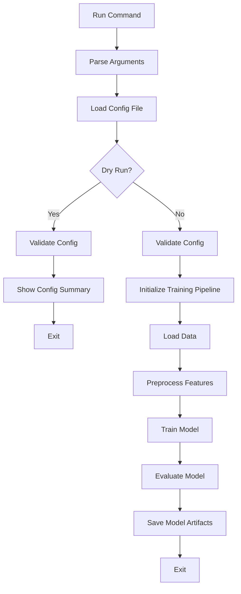
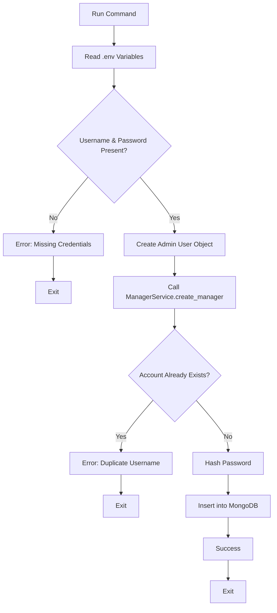

# 🎯 management/commands — Custom CLI Commands

## 📁 Overview

This directory contains **2 custom Django management commands**:

1. **train_model.py** — Train the weather forecast ML model
2. **insert_first_data.py** — Seed the first admin account into MongoDB

---

## 📂 Directory Structure

```
management/commands/
├── __init__.py              # Required for Django command discovery
├── train_model.py           # ML model training command
├── insert_first_data.py     # Admin account seeding command
└── README.md                # This file
```

---

## 📄 Files Explained

### `train_model.py` — ML Model Training Command

#### Purpose

Train the **weather forecast machine learning model** using configuration from JSON/YAML files.

#### Usage

```bash
# Train with default config
python manage.py train_model

# Train with custom config
python manage.py train_model --config /path/to/custom_config.json

# Dry run (validate config without training)
python manage.py train_model --dry-run
```

#### Arguments

| Argument | Type | Default | Description |
|----------|------|---------|-------------|
| `--config` | str | `Machine_learning_model/config/train_config.json` | Path to training configuration file |
| `--dry-run` | flag | False | Load and validate config without running training |

#### Process Flow



#### Example Output

```bash
$ python manage.py train_model

Using config: /path/to/train_config.json
Loading training data...
Preprocessing features...
Training XGBoost model...
Epoch 1/10: loss=0.345, accuracy=0.876
Epoch 2/10: loss=0.298, accuracy=0.891
...
Model training complete!
Saved to: Machine_learning_artifacts/latest/
```

#### Code Structure

```python
class Command(BaseCommand):
    help = "Train the weather forecast ML model using train_config.json"
    
    def add_arguments(self, parser):
        parser.add_argument("--config", type=str, default=None)
        parser.add_argument("--dry-run", action="store_true", default=False)
    
    def handle(self, *args, **options):
        # 1. Resolve config path
        cfg_path = Path(options["config"]) if options["config"] else DEFAULT_CONFIG
        
        # 2. Load and validate config
        config = _load_config(cfg_path)
        
        # 3. Run training or dry run
        if options["dry_run"]:
            self.stdout.write("Dry run mode — config validated ✓")
        else:
            run_training(config)
            self.stdout.write(self.style.SUCCESS("Training complete!"))
```

#### Related Files

- **Config**: `Machine_learning_model/config/train_config.json`
- **Trainer**: `Machine_learning_model/trainning/train.py`
- **Artifacts**: `Machine_learning_artifacts/latest/`

---

### `insert_first_data.py` — Admin Account Seeding Command

#### Purpose

Create the **first admin account** in MongoDB during initial setup. This is a **one-time** command typically run after:
- Fresh database setup
- Docker container initialization
- Development environment setup

#### Usage

```bash
python manage.py insert_first_data
```

**No arguments required** — reads credentials from `.env` file.

#### Environment Variables Required

Add these to your `.env` file:

```env
USER_NAME_ADMIN=admin
ADMIN_PASSWORD=SecurePassword123!
ADMIN_EMAIL=admin@weatherapp.com
```

#### Process Flow



#### Example Output

```bash
$ python manage.py insert_first_data

✓ Admin account created successfully!
  Username: admin
  Email: admin@weatherapp.com
  Role: Admin
```

#### Error Handling

**Error 1: Missing Environment Variables**

```bash
$ python manage.py insert_first_data

✗ LACK USER_NAME_ADMIN OR ADMIN_PASSWORD in .env
```

**Solution**: Add credentials to `.env` file.

**Error 2: Duplicate Username**

```bash
$ python manage.py insert_first_data

✗ Error: Username 'admin' already exists
```

**Solution**: Admin already created — no action needed.

#### Code Structure

```python
class SeedUser:
    """Fake user object with admin role for authorization checks"""
    role = "admin"

class Command(BaseCommand):
    help = "Seed admin account into MongoDB (first time)."
    
    def handle(self, *args, **options):
        # 1. Read environment variables
        username = config("USER_NAME_ADMIN", default=None)
        password = config("ADMIN_PASSWORD", default=None)
        email = config("ADMIN_EMAIL", default="admin@local.com")
        
        # 2. Validate required fields
        if not username or not password:
            self.stdout.write(self.style.ERROR("LACK USER_NAME_ADMIN OR ADMIN_PASSWORD in .env"))
            return
        
        # 3. Create seed user (for authorization)
        seed_user = SeedUser()
        
        # 4. Call service to create admin
        ManagerService.create_manager(
            seed_user,
            "Administrator",
            username,
            password,
            email,
            role="admin"
        )
        
        self.stdout.write(self.style.SUCCESS("Admin account created!"))
```

#### Security Notes

- ✅ Password is **hashed** (bcrypt + pepper) before storage
- ✅ Uses **environment variables** (not hardcoded)
- ✅ **One-time** operation (fails if admin exists)
- ⚠️ Keep `.env` file **secure** (add to `.gitignore`)

#### Related Files

- **Service**: `scripts/Login_services.py` (ManagerService)
- **Repository**: `Repositories/Login_repositories.py`
- **Model**: `Models/Login.py`
- **Config**: `.env` (environment variables)

---

## 🔧 Common Use Cases

### Use Case 1: Initial Project Setup

```bash
# 1. Setup MongoDB
sudo systemctl start mongodb

# 2. Run migrations (if using Django ORM)
python manage.py migrate

# 3. Seed admin account
python manage.py insert_first_data

# 4. Train initial ML model
python manage.py train_model
```

### Use Case 2: Retrain Model Weekly (Cron Job)

```bash
# Add to crontab
crontab -e
```

```cron
# Retrain ML model every Sunday at 2 AM
0 2 * * 0 cd /path/to/PROJECT_WEATHER_FORECAST && python manage.py train_model
```

### Use Case 3: Docker Initialization

```dockerfile
# Dockerfile entrypoint
CMD ["sh", "-c", "python manage.py insert_first_data && python manage.py runserver 0.0.0.0:8000"]
```

---

## 🐛 Common Issues

### Issue 1: Command Hanging (train_model)

**Symptom**: Command runs indefinitely without output

**Causes**:
1. Large dataset (training takes hours)
2. Infinite loop in training code
3. Waiting for user input (should be non-interactive)

**Solution**:
```bash
# Add timeout
timeout 3600 python manage.py train_model  # 1 hour max

# Run in background and log output
nohup python manage.py train_model > train.log 2>&1 &
```

### Issue 2: Config File Not Found

**Error**: `Config not found: /path/to/train_config.json`

**Solution**: Check config path or specify absolute path
```bash
python manage.py train_model --config /absolute/path/to/config.json
```

### Issue 3: Admin Already Exists

**Error**: `DuplicateKeyError: E11000 duplicate key error`

**Cause**: Admin account already created

**Solution**: This is expected — command should only run once. If you need to reset:
```javascript
// Connect to MongoDB
mongosh

// Use database
use weather_forecast

// Delete admin
db.managers.deleteOne({userName: "admin"})

// Re-run command
python manage.py insert_first_data
```

---

## 🚀 Future Enhancements

### For `train_model.py`

- [ ] Add **--model-type** argument (XGBoost, LightGBM, ensemble)
- [ ] Add **--epochs** argument (override config epochs)
- [ ] Add **progress bar** (tqdm integration)
- [ ] Add **email notification** when training completes
- [ ] Add **GPU support** detection

### For `insert_first_data.py`

- [ ] Add **--interactive** mode (prompt for credentials)
- [ ] Add **--force** flag (overwrite existing admin)
- [ ] Add **multiple admins** seeding from JSON file
- [ ] Add **role validation** (ensure "admin" is valid role)

---

## 📞 Related Files

- **Parent**: `management/README.md` (overview of management commands)
- **Services**: `scripts/Login_services.py` (ManagerService)
- **ML Training**: `Machine_learning_model/trainning/train.py`
- **Config**: `Machine_learning_model/config/train_config.json`
- **Environment**: `.env` (credentials)

---

## 👨‍💻 Maintainer

**Võ Anh Nhật**  
📧 voanhnhat1612@gmail.com

---

*Last Updated: March 8, 2026*
